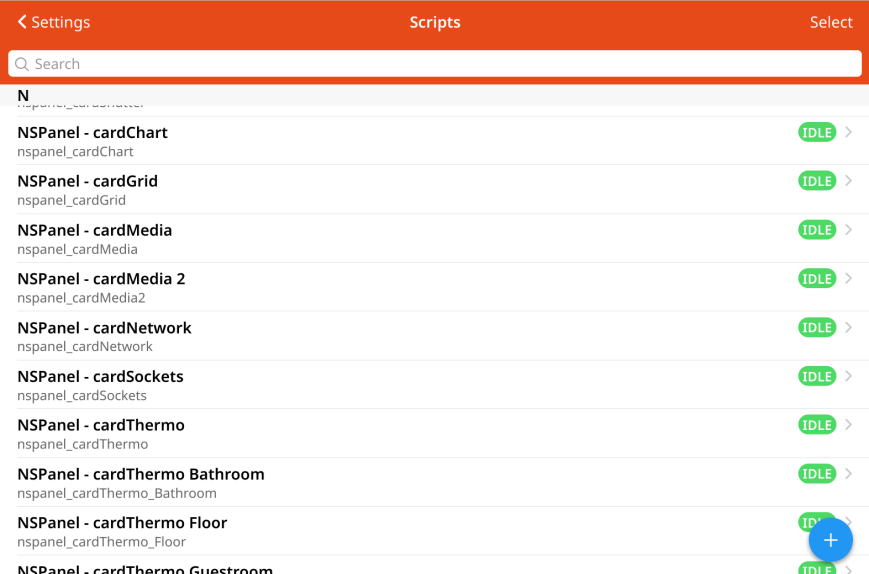
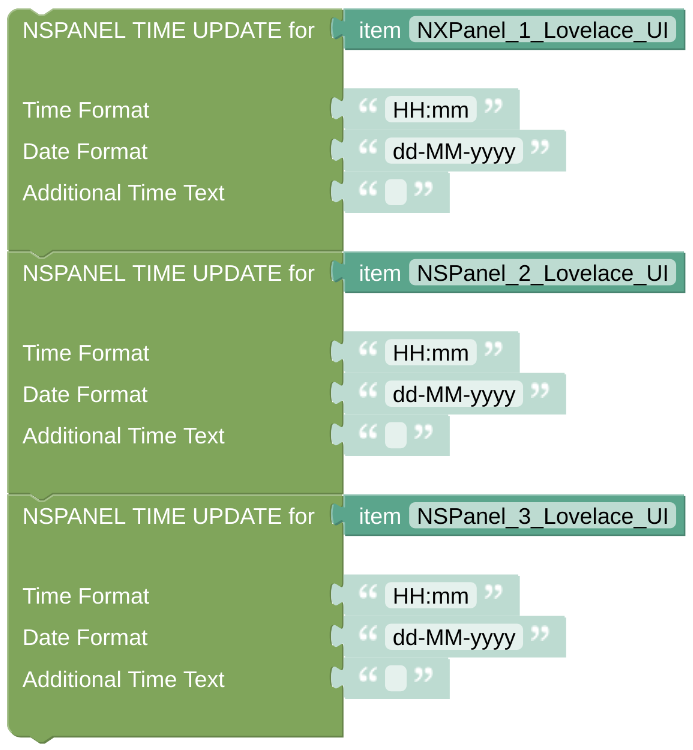

# openhab-blockly-nspanel

openHAB blockLibrary for nspanel lovelace UI

## About

This is a collection of blockLibraries to use the [NSPanel](https://sonoff.tech/product/central-control-panel/nspanel/) with the [*Lovelace UI*](https://github.com/joBr99/nspanel-lovelace-ui). Before this extension was born, the only (documented) way of using NSPanel with openHAB was [NXPanel](https://community.openhab.org/t/nxpanel-replacement-firmware-for-sonoff-nspanel/132869). NXPanel is [closed source](https://community.openhab.org/t/nxpanel-replacement-firmware-for-sonoff-nspanel/132869/224). I didn't liked the screensaver of NXPanel (which is the thing you mostly see on the panel), I didn't liked the closed source approach and I couldn't believe the saying that *Lovelace UI* is not supported by openHAB.

Using some blockLibraries as a base of this add-on gives you the option to configure every *Card* (as pages are named in *Lovelace UI* slang) the way you like, without any coding, just by using the [blockly click-and-go interface of openHAB](https://www.youtube.com/watch?v=EdllUlJ7p6k&t=1739s).

## Installation

As of now (Dec. 2023) the installation of the add-on is a little tricky. Call it 'alpha', even if I expect the software to be 'beta' already :)

### via the openHAB Marketplace

The openHAB Marketplace does [not yet support multiple blockLibrary templates in one file](https://github.com/openhab/openhab-core/issues/2509). Adding multiple files as some bundle to one marketplace add-on is also not supported. Therefore you have to install all the 5 required blockLibraries separately, and best keep them at the same release to get them running. The 5 add-ons are:

- [NSPanel Helpers](https://community.openhab.org/t/nspanel-lovelace-ui-helpers-part-1-5/152029)

- [NSPanel Entities](https://community.openhab.org/t/nspanel-lovelace-ui-entities-part-2-5/152030)

- [NSPanel Cards](https://community.openhab.org/t/nspanel-lovelace-ui-cards-part-3-5/152031)

- [NSPanel Screensaver](https://community.openhab.org/t/nspanel-lovelace-ui-screensaver-part-4-5/152032)

- [NSPanel Callback](https://community.openhab.org/t/nspanel-lovelace-ui-callback-part-5-5/152033)

### manually

You can add the required libraries by copy/pasting the following files into openHAB

- [NSPanel Helpers](https://raw.githubusercontent.com/absorb-it/openhab-blockly-nspanel/main/blockly/libraries/nspanel/nspanel_helpers.yaml)

- [NSPanel Entities](https://raw.githubusercontent.com/absorb-it/openhab-blockly-nspanel/main/blockly/libraries/nspanel/nspanel_entities.yaml)

- [NSPanel Cards](https://raw.githubusercontent.com/absorb-it/openhab-blockly-nspanel/main/blockly/libraries/nspanel/nspanel_cards.yaml)

- [NSPanel Screensaver](https://raw.githubusercontent.com/absorb-it/openhab-blockly-nspanel/main/blockly/libraries/nspanel/nspanel_screensaver.yaml)

- [NSPanel Callback](https://raw.githubusercontent.com/absorb-it/openhab-blockly-nspanel/main/blockly/libraries/nspanel/nspanel_callback.yaml)

 

Open your openHAB developers area, choose the "Block Libraries" section and press the round blue plus sign to add a library. Just copy the files above step by step over the preset skeleton you get there, save the file and create the next one. Two things to be aware of: 1. you can overwrite the skeleton before it is saved, but you can't change any uid (see first line of skeleton) once a file *was* saved. 2. parsing and saving might take it's time, especially with the *NSPanel Helpers* file, which is really huge. Just relax and wait a while.

 

In the end you should have a good collection of libraries, everything is ready to get started.

 

## Configuration

### Preparation

To use the *Lovelace UI* on your NSPanel, you have to install [Tasmota](https://tasmota.github.io/) first. As a second step you need to install the TFT-file, which contains the *Lovelace UI* firmware. Just check the description about how to [prepare the NSPanel](https://docs.nspanel.pky.eu/stable/prepare_nspanel/). There are also a lot of videos in the net about how to get this done. 

 

As a next step you need to create some *MQTT Broker* in openHAB, I assume you already have one running. You need to add some "Generic MQTT Thing" and connect it to the *MQTT Broker*. As you can see, it's as generic that I still forgot to change it after I moved away from NXpanel :)

 

As usual in openHAB, you need to create some *Item* based on that *Thing* which than, finally, will hold the *Channel* which handles all the MQTT messages. You will have to link to this *Item* a lot of times, maybe choose some meaningful name.

 

Now add some *Channel* and enter the receiving and sending MQTT topics for you NSPanel. You can configure these in the Tasmota Web Interface of your panel, you can see the nearly default topics in the screenshot beside.

- default receiving topic: tele/[NAME]_[MACADR]/RESULT

- default sending topic: cmnd/[NAME]_[MACADR]/CustomSend

 

### Principle of Operation

Before starting the configuration of these libraries you need to get a little bit familiar to the overall concept of this add-on. In the image you can see the display itself (hardware), the *MQTT-Broker* and the *Lovelace UI Item* as you configured them already. Now some *Rule* has to be added, which triggers the [*Callback*](docs/blockLibrary_nspanel_callback_callback.md) on any change of the Item state (any received relevant MQTT message or any direct change).

This *Callback* will forward your message to the last or any new *Card* you requested by parsing this message. These *Cards* are just *Scripts* you created, which can have some forward and backwards navigation items on top. These items will contain references to other *Scripts* for navigation between you *Cards*. This way you can configure any navigation you like between all of your *Cards* .

 

One **important issue** with this concept is, that you need to reference your *Scripts* (and *Rules*) by there (internal) name, by there id or uid, quite often. By default, openHAB will give any Rule or Script you create some random (internal) name, like for instance '03f74d4dc'. That's hard to remember.

But you can change this internal name, this id, just once while creating the *Script* or *Rule* as long as it is unique for your openHAB installation. No further change is possible, therefore you have to know what you are creating before you do this. Name you *Rules* like 'WeatherUpdate', name your *Scripts* like 'nspanel1_cardPower' and everything will work much smoother. And, just to e clear, I'm just talking about the internal name, the id or uid of some *Rule* or *Script*. References to the *Label* cannot be used (as of now).

 

### Configure the Callback

 

Create some rule, which triggers on any update of your *NSPanel Item*. Let it execute some *Blockly Script*. In Blockly, choose the *Callback* from the Library section of the Toolbox.

 

The *Callback* needs to send messages to the panel, therefore it needs some link to the *NSPanel Item*. You might like to add some *Script* or *Rule* which will [update the Icons on your screensaver](docs/openhab_rules_weatherupdate.md), and you might add some *Script* which will [configure your first *Card*](docs/openhab_scripts_nspanel1_cardQR.md). Add both *Scripts* and *Rules* by referencing there internal ids - in the example screenshot you can also see how important it might be, to use meaningful names for these ids. You can reference them even before they are created, at least these references to the scripts can be changed whenever you like.

 

### Configure the Time and Date

Create some *Rule* which triggers every minute. Add some Blockly script, add the [Time Update](docs/blockLibrary_nspanel_callback_timeUpdate.md) callback from the library section of your toolbox. Configure the target *NSPanel Item*, and your done.

 

 

## Does it really work?

On of the issues with the general concept of this display is, that any greater display change will require some server action, letting some script respond to some incoming MQTT message. In all available implementations, also in *Lovelace UI*, this might introduce some lag of reaction. Nowaday kids won't accept such a lag on their mobile phones :)

Anyway, you might realize that there is a huge difference between any first call of some Card and any later calls, the caching of openHAB works wonders.

Beside, the display is still perfect to give some information, which gets sent from the server to the panel and does not have to be on a millisecond response. You can use the display as some intelligent info-display with switching opportunity, but personally I won't use too many of the different cards for my home setup. If you change the display actively from the server side, if you show the [*Media Card*](docs/blockLibrary_nspanel_cards_cardMedia.md) when the amplifier is switched on, you can come around the lags when using the display navigation on its own.

And finally, it works! Therefore:

## Enjoy the beauty of this panel

Yeah! Hopefully you have now some running screensaver and if you are already started playing, you might have found your way on your own. But in any case, there is some [extensive documentation](docs/README.md) - containing some complete configuration examples - available. Have fun now!

 
