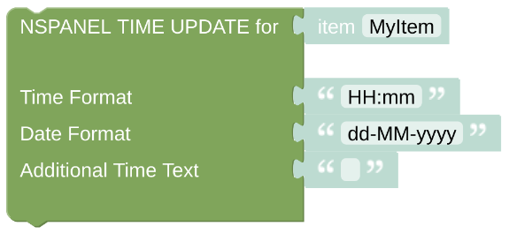
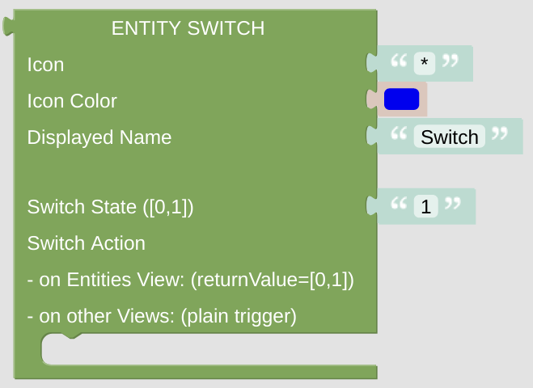
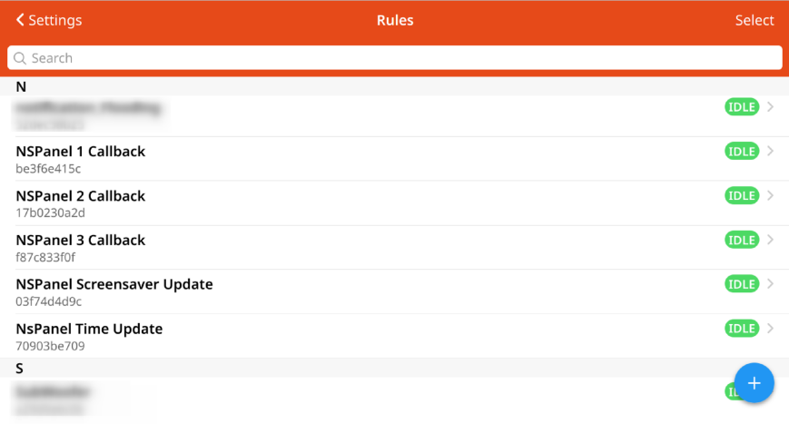

# Openhab Blockly Nspanel - Library Documentation

## Library Parts

### Helper Library

- [get NSPanel Item from Context](blockLibrary_nspanel_helpers_getContextItem.md)
- [set NSPanel Item if Context not found](blockLibrary_nspanel_helpers_setNSPanelIfNotContext.md)
- [start Script with forced Context](blockLibrary_nspanel_helpers_startScriptWithContext.md)
- [get Icon for IconName](blockLibrary_nspanel_helpers_getIconForName.md)
- [get IconName for Weathercode](blockLibrary_nspanel_helpers_getIconNameForWeathercode.md)
- [get Navigation String](blockLibrary_nspanel_helpers_navString.md)
- [get HVAC Button](blockLibrary_nspanel_helpers_hvacButton.md)
- [get Alarm Button](blockLibrary_nspanel_helpers_alarmButton.md)
- [get WIFI QR String](blockLibrary_nspanel_helpers_QRString.md)
- [Example returnValue](blockLibrary_nspanel_helpers_returnValue.md)
- [Example returnMode](blockLibrary_nspanel_helpers_returnMode.md)
- [Example Getter Statement](blockLibrary_nspanel_helpers_exampleGetter.md)
- [Example Setter Statement](blockLibrary_nspanel_helpers_exampleSetter.md) 

### Cards Library

- [Alarm Card](blockLibrary_nspanel_cards_cardAlarm.md)
- [Chart Card](blockLibrary_nspanel_cards_cardChart.md)
- [Entities Card](blockLibrary_nspanel_cards_cardEntities.md)
- [Grid Card](blockLibrary_nspanel_cards_cardGrid.md)
- [Media Card](blockLibrary_nspanel_cards_cardMedia.md)
- [Power Card](blockLibrary_nspanel_cards_cardPower.md)
- [QR Card](blockLibrary_nspanel_cards_cardQR.md)
- [Thermo Card](blockLibrary_nspanel_cards_cardThermo.md)
- [Thermo Popup](blockLibrary_nspanel_cards_popupThermo.md) 

### Callback Library

- [Callback](blockLibrary_nspanel_callback_callback.md)
- [Time Update](blockLibrary_nspanel_callback_timeUpdate.md) 

### Screensaver/Notification Library

- [Full Page Notification](blockLibrary_nspanel_screensaver_fullNotification.md)
- [set Screensaver Colors](blockLibrary_nspanel_screensaver_screensaverColors.md)
- [show Screensaver Notification](blockLibrary_nspanel_screensaver_screensaverNotification.md)
- [set Screensaver Status Icons](blockLibrary_nspanel_screensaver_screensaverStatusIcons.md)
- [update Screensaver Icons + Texts (complex)](blockLibrary_nspanel_screensaver_updateComplex.md)
- [update Screensaver Icons + Texts (standard)](blockLibrary_nspanel_screensaver_updateStandard.md) 

### Entities Library

- [Button](blockLibrary_nspanel_entities_button.md)
- [Fan Control](blockLibrary_nspanel_entities_fan.md)
- [Label](blockLibrary_nspanel_entities_label.md)
- [Light Control](blockLibrary_nspanel_entities_light.md)
- [Item Selector](blockLibrary_nspanel_entities_selector.md)
- [Window Shutter Control](blockLibrary_nspanel_entities_shutter.md)
- [Switch](blockLibrary_nspanel_entities_switch.md)
- [Timer Control](blockLibrary_nspanel_entities_timer.md) 

## Configuration Examples

### Example Rules

- [Callback Rule](openhab_rules_callback.md)
- [Timeupdate Rule](openhab_rules_timeupdate.md)
- [Screensaver Update Rule](openhab_rules_ssaverupdate.md) 

### Example Cards

- [Alarm Card](openhab_scripts_nspanel1_cardAlarm.md)
- [Chart Card](openhab_scripts_nspanel1_cardChart.md)
- [Entities Card](openhab_scripts_nspanel1_cardEntities.md)
- [Grid Card](openhab_scripts_nspanel1_cardGrid.md)
- [Media Card](openhab_scripts_nspanel1_cardMedia.md)
- [Power Card](openhab_scripts_nspanel1_cardPower.md)
- [QR Card](openhab_scripts_nspanel1_cardQR.md)
- [Thermo Card](openhab_scripts_nspanel1_cardThermo.md) 

## Remote Control Options

See [Callback](blockLibrary_nspanel_callback_callback.md) for further information.

---

[Openhab Blockly Nspanel - Usage and Installation](../README.md)

---
