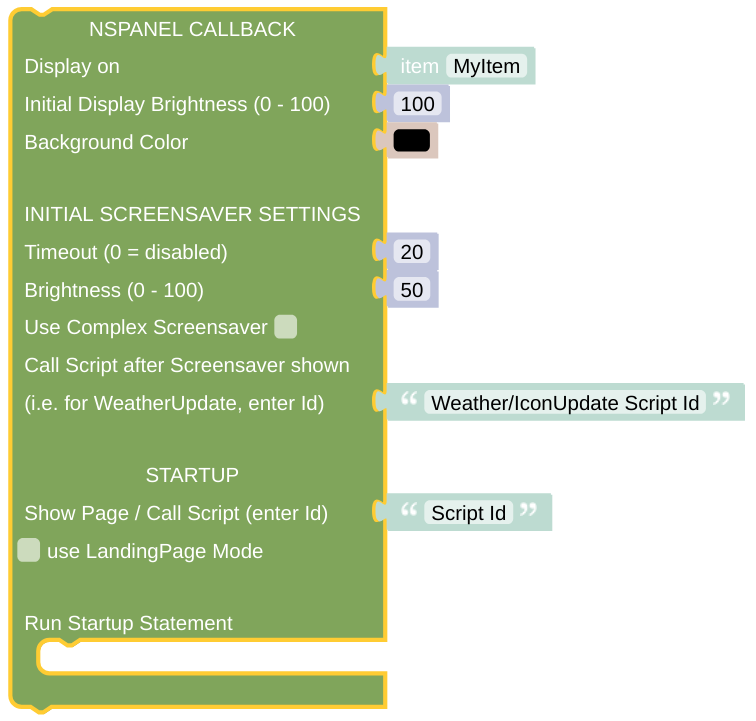

# Callback

The Callback is the central part which will react on every message from the display and forward the information to the right sub-routine. It should normally be triggered by some rule, have a look at the [Installation information](../README.md) or the [related rule details](openhab_rules_callback.md).

## Special Options of the Callback

The Callback is made to forward the received MQTT message from the Item to the last active script (Card / Page). Beside, it will actively check if the received MQTT is some result of the calling card and give this information to the script as well. Some special options, which might be triggered by directly changing the state of the *NSPanel Item* can modify this behavior a little bit.

### refresh

The current card just gets refreshed. Maybe something in the openHAB environment changed and you like to display this change on the current card? Just set the state of the *NSPanel Item* to 'refresh'.

### refreshTimer

The 'refreshTimer' option is mainly used internally to auto-refresh some page. You can find the related configuration option on every card. The difference to a plain 'refresh' is, that the refresh is only done if the screen saver is not shown.

### loadPage

If you set the state of the *NSPanel Item* to 'loadPage?yourScriptID' (and replace yourScriptID with a script you created, which displays a Card), you can load this Card. The difference to start the script directly is, that the callback will remember this Card and might display a screen saver over it, go back to this Card when the screen saver is finished or do a refresh of this Card without any further information.

### loadScreensaver

Set the *NSPanel Item* to 'loadScreensaver' and it directly activates the screensaver.

### newTimeout

Provide the new screensaver timeout as a parameter to the related state change, like 'newTimeout?30' to set the timeout to 30 seconds.

### newBrigthness

You can also modify the brightness settings of the display on the fly, maybe to dim the panel down by night. Just provide the screensaver brightness as the first parameter, the normal brightness as the second parameter. For instance as 'newBrigthness?35?80'. 

### complexScreenSaver

You can decide, if you like to change to the more complex screensaver or change back to the normal one. Supply 'complexScreenSaver?TRUE' or 'complexScreenSaver?FALSE', however you like this. Be aware that this will only take effect onc the screensaver is shown again. If you like this change to be immediate, than [reload the Screensaver](blockLibrary_nspanel_helpers_loadScreensaver.md) manually.

### enterScriptName

Set some new script for configuration of the screensaver (script will run after you entered the screensaver). Set the *NSPanel Item* to 'enterScriptName?ScriptID' and from this time on the scipt with the Id (not the label) ScriptID will get called.

### leaveScriptName

Usually you will end on the page screensaver got activated when you leave the screensaver again. You might have choosen some landing page feature by activating the "run also after leaving Screensaver" option for your startup script.

Here you can change this behavior. Just set your *NSPanel Item* to 'leaveScriptName?ScriptID' and the option of using a landing page gets activated with the script ScriptID getting called everytime you leave the screensaver. Set *NSPanel Item* to 'leaveScriptName' without any script and the landing page feature gets disabled, you will return to the last called page when leaving the screensaver again.

## Configuration

- The *NSPanel Item* which is used to control the panel with MQTT.
- The Brightness for the activated display (for instance after some touch event) as numerical value between 0 and 100.

The *Callback* will configure the screensaver after receiving the display startup message. The following settings are relevant for the screensaver:

- The Screensaver timeout in seconds - enter 0 here to disable the automatic display of the screensaver completely.
- The Brightness for the Screensaver as numerical value between 0 and 100. 
- You can decide, if you like to use a more [complex Screensaver](https://docs.nspanel.pky.eu/img/screensaver2.png), displaying more than 15 states, instead of the [usual one](https://docs.nspanel.pky.eu/img/screensaver.png), which gives you around 5 states on the display.
- You can enter a script name (the script ID, not the Label!), which is called whenever the screensaver is activated. This can be used to renew all the icons and status informations on the screensaver.

You might also like to display some initial card (page) after starting.

- Add the ID of some script configuring your *Card*. You might decide if this *Card* is shown every time you are leaving your screensaver (like a landing page for naviation) or if you like to reach the last *Card* shown instead.
- Run any statement you like. This statement will only be run once during initial startup.

## Context information

All scripts (*Pages*, *Cards*) started via the *CallBack* will get not only the information about some last display action, but also always the *NSPanel Item* to work with as context information. This is done to enable the reuse of your scripts for multiple panels. Standard Cards require this information to run and will usually not work if the context is missing. 

---

[Openhab Blockly Nspanel - Library Documentation](README.md)

---
