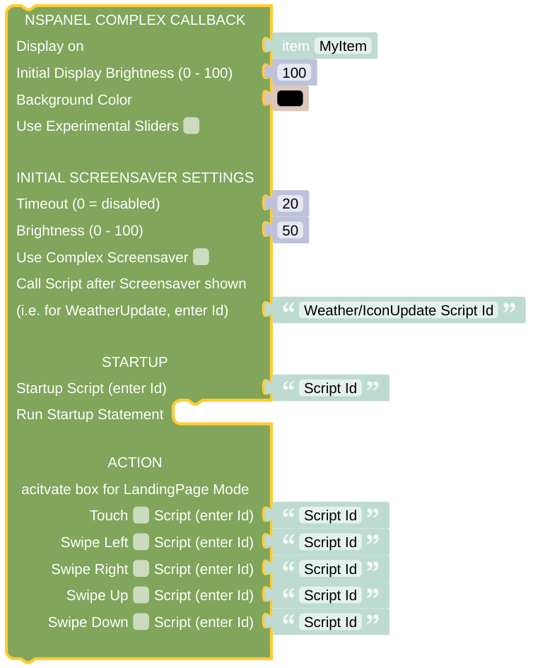

# Complex Callback

The Callback is the central part which will react on every message from the display and forward the information to the right sub-routine. It should normally be triggered by some rule, have a look at the [Installation information](../README.md) or the [related rule details](openhab_rules_callback.md). The Complex Callback gives you access to all the options which are hidden in the [much simpler standard version](blockLibrary_nspanel_callback_callback.md) - behind the scenes the same script is used for both versions.

Also have a look the [API for direct updates](blockLibrary_nspanel_callback_API.md) of the callback settings.

## Configuration

- The *NSPanel Item* which is used to control the panel with MQTT.
- The Brightness for the activated display (for instance after some touch event) as numerical value between 0 and 100.
- The Background Color of the panel.
- You can enable the usage of [experimental sliders](https://github.com/joBr99/nspanel-lovelace-ui/issues/945), if you are using some recent Lovelace UI firmware. Best leave un-checked.

The *Callback* will configure the screensaver after receiving the display startup message. The following settings are relevant for the screensaver:

- The Screensaver timeout in seconds - enter 0 here to disable the automatic display of the screensaver completely.
- The Brightness for the Screensaver as numerical value between 0 and 100. 
- You can decide, if you like to use a more [complex Screensaver](https://docs.nspanel.pky.eu/img/screensaver2.png), displaying more than 15 states, instead of the [usual one](https://docs.nspanel.pky.eu/img/screensaver.png), which gives you around 5 states on the display.
- You can enter a script name (the script ID, not the Label!), which is called whenever the screensaver is activated. This can be used to renew all the icons and status informations on the screensaver.

You might also like to display some initial card (page) after starting.

- Add the ID of some script running once displaying some Welcome- *Card*. 
- Run any statement you like. This statement will only be run once during initial startup.

Once the Screensaver is shown, you surely like also to leave it. Now you can add some fine-grained configuration which actions should happen. Be aware that the swipe actions are sometimes hard to trigger - you might always end up with some touch event instead if the desired swipe event.

- Add the ID of some script running when touched or swiped. You can activate the checkbox to use the script as some Landing Page.
- Additionally you can add some timeout in seconds after which the last active page before the Screensaver was shown is forgotten and the mentioned scripts will be called as in LandingPage mode.

## Context information

All scripts (*Pages*, *Cards*) started via the *CallBack* will get not only the information about some last display action, but also always the *NSPanel Item* to work with as context information. This is done to enable the reuse of your scripts for multiple panels. Standard Cards require this information to run and will usually not work if the context is missing. 

---

[Openhab Blockly Nspanel - Library Documentation](README.md)

---
