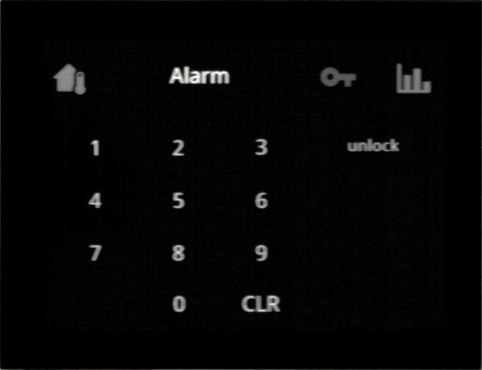
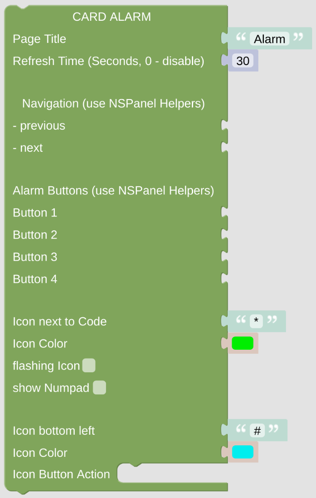

# cardAlarm

The cardAlarm gives you some input options to enter some protection code. The PIN is sent back to your openHAB software. Every action based on the right or wrong code will be handled in openHAB as well. 

[Example Configuration](openhab_scripts_nspanel1_cardAlarm.md) 

## Configuration

### Standard Top Configuration

- The *NSPanel Item* which is used to control the panel with MQTT.
- The Page Title which is used for this page.
- The Refresh Time, after that time the page contents got refreshed. This might be useful when displaying some changing entities on the page, like lights or switches, to keep them in sync with their openHAB status (you can also use some rule to trigger the update via the [Callback remote control options](blockLibrary_nspanel_callback_callback.md)).
- Navigation items (previous, next) to easily enable some link to other cards. Best choose the [Navigation String Helper](blockLibrary_nspanel_helpers_navString.md) from the NSPanel Helpers Menu. These items will be displayed in the top area left or right.

### Special Configuration for cardAlarm

- Add up to 4 different [Alarm Buttons](blockLibrary_nspanel_helpers_alarmButton.md) on the right side of the display to indicate different settings or enable some actions.
- You can add some Icon beside the code to be entered, and decide if a numpad should be shown.
- There is some option for another Icon on the bottom left of the display, which can also trigger some action. 

---

[Openhab Blockly Nspanel - Library Documentation](README.md)

---
