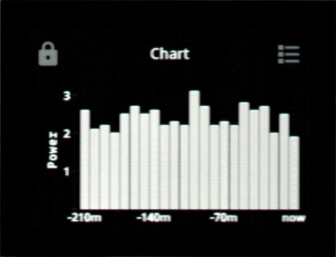
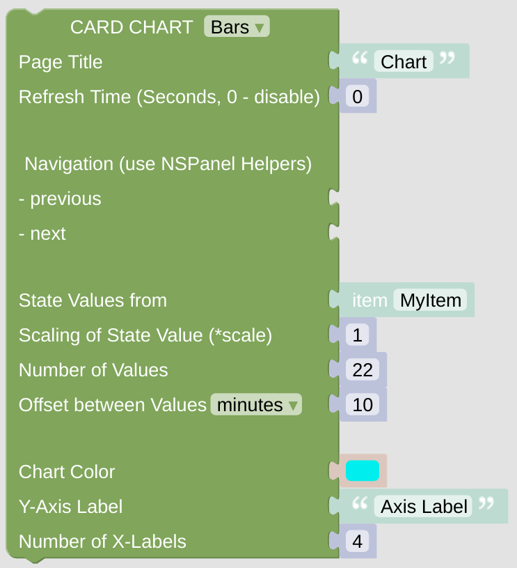

# cardChart

The cardChart gives you the chance to display some values graphically as a bar or line chart. Be aware that all graphical calculations have to be done on the display itself, so be careful not to supply too much data.

[Example Configuration](openhab_scripts_nspanel1_cardChart.md)

## Configuration

On top of the module you have to decide if you like to display your values as a bar or a line-chart.

### Standard Top Configuration

- The *NSPanel Item* which is used to control the panel with MQTT.

- The Page Title which is used for this page.

- The Refresh Time, after that time the page contents got refreshed. This might be useful when displaying some changing entities on the page, like lights or switches, to keep them in sync with their openHAB status (you can also use some rule to trigger the update via the [Callback remote control options](blockLibrary_nspanel_callback_callback.md)).

- Navigation items (previous, next) to easily enable some link to other cards. Best choose the [Navigation String Helper](blockLibrary_nspanel_helpers_navString.md) from the NSPanel Helpers Menu. These items will be displayed in the top area left or right.

### Special Configuration for cardChart

- You need to get some values to display in your chart - therefore you need to select some Item which holds also historical data. If you can see some line chart in openHAB displaying your values, it usually does so. Select this item in the State Value field.
- The scaling of the value seems to be really important for bar charts. The value retrieved from your Item State is multiplied with the scale and the result should be between 0 and 196. This seems to be defined by the panel and is fixed in the *Lovelace UI*. Line Charts seem not to be affected by this limitation.
- Decide how many values you like to display and which distance (=offset) should be between these values. Be aware that the panel can't handle too many values.
- Configure the Color and the Axis Labels. The Number of X-Axis Labels is used only in bar graphs.

---

[Openhab Blockly Nspanel - Library Documentation](README.md)

---
