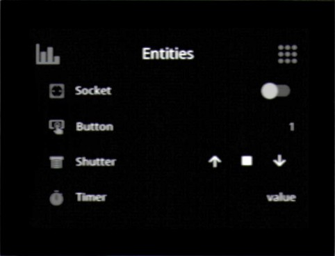
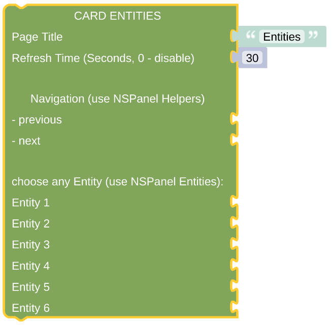

# cardEntities

The cardEntities page gives you the overview of the status of up to 4 different entities. You can modify them directly on this page or access some sub-pages, popups, to do more detailed configurations.

[Example Configuration](openhab_scripts_nspanel1_cardEntities.md)

**Important:** This *Card* will do nothing if called directly without any context. At least it requires some information about the *NSPanel Item* to work with, which is usually supplied from the *CallBack* calling the script with this *Card*. To [enable direct testing in your Blockly editor](blockLibrary_nspanel_helpers_setNSPanelIfNotContext.md) or to [force the *NSPanel Item*](blockLibrary_nspanel_helpers_startScriptWithContext.md) you can use the related helpers. To get to know [which *NSPanel Item* you are working on](blockLibrary_nspanel_helpers_getContextItem.md), use some helper as well. 

## Configuration

### Standard Top Configuration

- The Page Title which is used for this page.
- The Refresh Time, after that time the page contents got refreshed. This might be useful when displaying some changing entities on the page, like lights or switches, to keep them in sync with their openHAB status (you can also use some rule to trigger the update via the [Callback remote control options](blockLibrary_nspanel_callback_callback.md)). This refresh timeout won't work (and will be ignored) when [directly started with context](blockLibrary_nspanel_helpers_startScriptWithContext.md), it needs to be called from *CallBack* for this to work.
- Navigation items (previous, next) to easily enable some link to other cards. Best choose the [Navigation String Helper](blockLibrary_nspanel_helpers_navString.md) from the NSPanel Helpers Menu. These items will be displayed in the top area left or right.

### Special Configuration for cardEntities

- Add up to 6 different Entities to indicate different settings or enable some actions. The EU-version of the NSPanel Display only supports up to 4 Entities - the additional Entitites will not have any effect here. See also [EU vs. US hardware](https://github.com/Blackymas/NSPanel_HA_Blueprint/discussions/713). The Icon will be displayed together with the Name and the Value. Some Entities allow direct actions on the main page, others allow access to a sub-page with some options.
- Choose any entity you like from the "NSPanel Entities" library:
  - [Entity Label](blockLibrary_nspanel_entities_label.md) - some Icon with a Label.
  - [Entity Button](blockLibrary_nspanel_entities_button.md) - has some additional Action trigger.
  - [Entity Switch](blockLibrary_nspanel_entities_switch.md) - has some on-off switch.
  - [Entity Light](blockLibrary_nspanel_entities_light.md) - has some additional Popup page for light settings.
  - [Entity Fan](blockLibrary_nspanel_entities_fan.md) - has some additional Popup page for fan control.
  - [Entity Shutter](blockLibrary_nspanel_entities_shutter.md) - looks like the Entity Button, but can open Shutter Popup.
  - [Entity Selector](blockLibrary_nspanel_entities_selector.md) - looks like the Entity Button, but can open Selector Popup.
  - [Entity Timer](blockLibrary_nspanel_entities_timer.md) - looks like the Entity Button, but can open Timer Popup. 

---

[Openhab Blockly Nspanel - Library Documentation](README.md)

---
