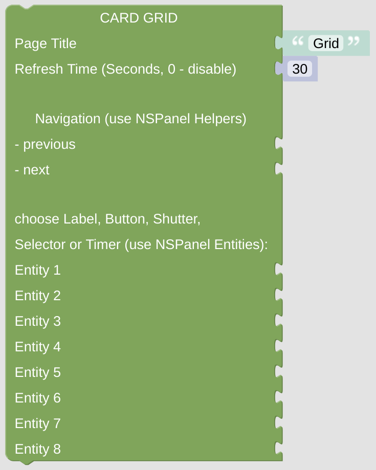

# cardGrid

The cardGrid can be used to display different entities and there status. Dependent on the chosen entities and your configuration a click on any of the buttons can result on opening of popups for fine-grain configuration or any action you like.

You can also use the cardGrid for navigation, for instance as some landing page which is always shown when you leave the screensaver. Just add an [entity button](blockLibrary_nspanel_entities_button.md), sending a [loadPage request](blockLibrary_nspanel_callback_callback.md#loadpage) to the [NSPanel Item retrieved from context](blockLibrary_nspanel_helpers_getContextItem.md).

[Example Configuration](openhab_scripts_nspanel1_cardGrid.md)

**Important:** This *Card* will do nothing if called directly without any context. At least it requires some information about the *NSPanel Item* to work with, which is usually supplied from the *CallBack* calling the script with this *Card*. To [enable direct testing in your Blockly editor](blockLibrary_nspanel_helpers_setNSPanelIfNotContext.md) or to [force the *NSPanel Item*](blockLibrary_nspanel_helpers_startScriptWithContext.md) you can use the related helpers. To get to know [which *NSPanel Item* you are working on](blockLibrary_nspanel_helpers_getContextItem.md), use some helper as well. 

## Configuration

### Standard Top Configuration

- The Page Title which is used for this page.

- The Refresh Time, after that time the page contents got refreshed. This might be useful when displaying some changing entities on the page, like lights or switches, to keep them in sync with their openHAB status (you can also use some rule to trigger the update via the [Callback remote control options](blockLibrary_nspanel_callback_callback.md)). This refresh timeout won't work (and will be ignored) when [directly started with context](blockLibrary_nspanel_helpers_startScriptWithContext.md), it needs to be called from *CallBack* for this to work.

- Navigation items (previous, next) to easily enable some link to other cards. Best choose the [Navigation String Helper](blockLibrary_nspanel_helpers_navString.md) from the NSPanel Helpers Menu. These items will be displayed in the top area left or right.

### Special Configuration for cardGrid

- Add up to 8 different Entities to indicate different settings or enable some actions. The Icon will be displayed together with the Name, the Value will be ignored. The layout will be automatically changed if slots 7 or 8 are used for some Entity.

- Only some Entities are useful, because there is not enough space on the Grid view to include a lot of additional functions. Choose one of the following entities from the "NSPanel Entities" library:
  
  - [Entity Label](blockLibrary_nspanel_entities_label.md) - some Icon with a Label
  - [Entity Button](blockLibrary_nspanel_entities_button.md) - has some additional Action trigger
  - [Entity Shutter](blockLibrary_nspanel_entities_shutter.md) - looks like the Entity Button, but can open Shutter Popup
  - [Entity Selector](blockLibrary_nspanel_entities_selector.md) - looks like the Entity Button, but can open Selector Popup
  - [Entity Timer](blockLibrary_nspanel_entities_timer.md) - looks like the Entity Button, but can open Timer Popup

---

[Openhab Blockly Nspanel - Library Documentation](README.md)

---
