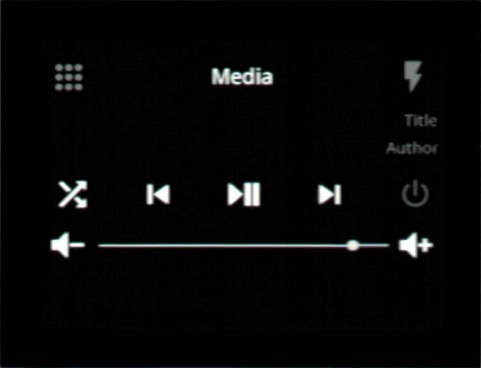
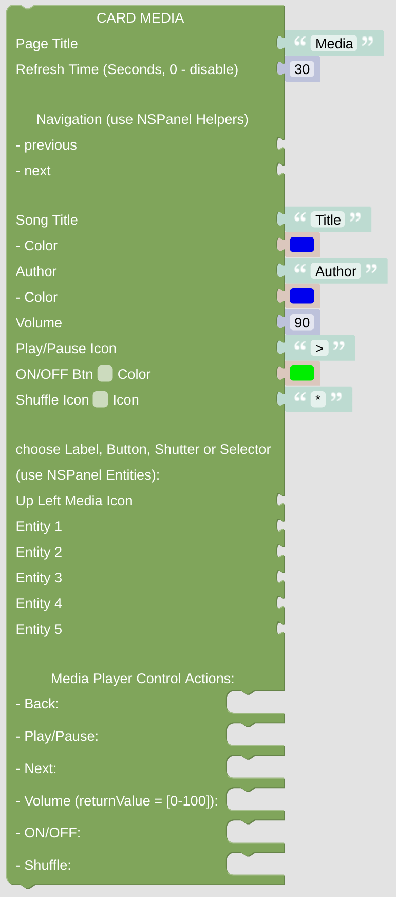

# cardMedia

The cardMedia page can e used to control some media player. Indicate what music is playing and change the sources, all possible with this card.

[Example Configuration](openhab_scripts_nspanel1_cardMedia.md)

 

## Configuration

### Standard Top Configuration

- The *NSPanel Item* which is used to control the panel with MQTT.

- The Page Title which is used for this page.

- The Refresh Time, after that time the page contents got refreshed. This might be useful when displaying some changing entities on the page, like lights or switches, to keep them in sync with their openHAB status (you can also use some rule to trigger the update via the [Callback remote control options](blockLibrary_nspanel_callback_callback.md)).

- Navigation items (previous, next) to easily enable some link to other cards. Best choose the [Navigation String Helper](blockLibrary_nspanel_helpers_navString.md) from the NSPanel Helpers Menu. These items will be displayed in the top area left or right.

### Special Configuration for cardMedia

- If you like to use it as a fancy media player frontend, you can display the Song Title and the Artist (or whatever you like) in any color you like.

- You can configure the preset Volume, which can be changed on the related slider.

- Select the controls you like to have added (ON/OFF, Shuffle) and configure them by selecting colors or icons.

- There is one Button located above the slider on the left and 5 other buttons are located below the Volume slider. The Icon will be displayed together with the Name, the Value will be ignored. Choose one of the following entities from the "NSPanel Entities" library:
  
  - [Entity Label](blockLibrary_nspanel_entities_label.md) - some Icon with a Label
  - [Entity Button](blockLibrary_nspanel_entities_button.md) - has some additional Action trigger
  - [Entity Shutter](blockLibrary_nspanel_entities_shutter.md) - looks like the Entity Button, but can open Shutter Popup
  - [Entity Selector](blockLibrary_nspanel_entities_selector.md) - looks like the Entity Button, but can open Selector Popup

- On the bottom of the module you can add some actions, which should be triggered on button presses. The Volume action will give you a [variable *returnValue*](blockLibrary_nspanel_helpers_returnValue.md), which contains the selected Volume.

---

[Openhab Blockly Nspanel - Library Documentation](README.md)

---
