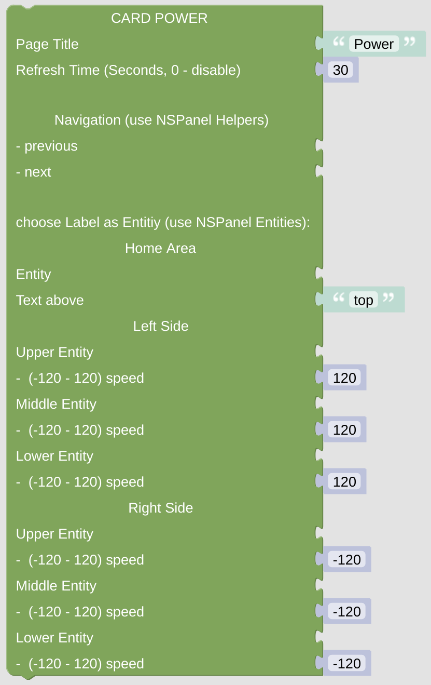

# cardPower

The power usage overview can be used to display your home power network. It is not made to trigger any actions. 

[Example Configuration](openhab_scripts_nspanel1_cardPower.md)

 

## Configuration

### Standard Top Configuration

- The *NSPanel Item* which is used to control the panel with MQTT.

- The Page Title which is used for this page.

- The Refresh Time, after that time the page contents got refreshed. This might be useful when displaying some changing entities on the page, like lights or switches, to keep them in sync with their openHAB status (you can also use some rule to trigger the update via the [Callback remote control options](blockLibrary_nspanel_callback_callback.md)).

- Navigation items (previous, next) to easily enable some link to other cards. Best choose the [Navigation String Helper](blockLibrary_nspanel_helpers_navString.md) from the NSPanel Helpers Menu. These items will be displayed in the top area left or right.

### Special Configuration for cardPower

- The *Home Area* entity will be displayed in the middle of the Card. You should use some [Label Entity](blockLibrary_nspanel_entities_label.md) for this field - the Name of the Label will be ignored, while the Value is shown below the Icon. Additionally you can display some Text above the Icon.

- The consumers are displayed on the left or right side of the card. You should use [Label Entities](blockLibrary_nspanel_entities_label.md) for these fields, the Icon will be displayed in a box, the name and the value are displayed near the power line. The speed of the indicator dot can be set with values between -120 to 120.

---

[Openhab Blockly Nspanel - Library Documentation](README.md)

---
