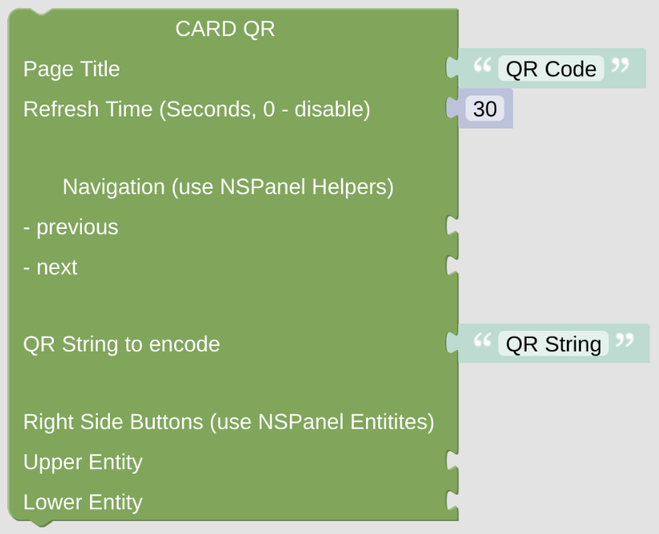

# cardQR

The cardQR will help your guests to connect to your WIFI. It will display some QR code

[Example Configuration](openhab_scripts_nspanel1_cardQR.md)

**Important:** This *Card* will do nothing if called directly without any context. At least it requires some information about the *NSPanel Item* to work with, which is usually supplied from the *CallBack* calling the script with this *Card*. To [enable direct testing in your Blockly editor](blockLibrary_nspanel_helpers_setNSPanelIfNotContext.md) or to [force the *NSPanel Item*](blockLibrary_nspanel_helpers_startScriptWithContext.md) you can use the related helpers. To get to know [which *NSPanel Item* you are working on](blockLibrary_nspanel_helpers_getContextItem.md), use some helper as well. 

## Configuration

### Standard Top Configuration

- The Page Title which is used for this page.
- The Refresh Time, after that time the page contents got refreshed. This might be useful when displaying some changing entities on the page, like lights or switches, to keep them in sync with their openHAB status (you can also use some rule to trigger the update via the [Callback remote control options](blockLibrary_nspanel_callback_callback.md)). This refresh timeout won't work (and will be ignored) when [directly started with context](blockLibrary_nspanel_helpers_startScriptWithContext.md), it needs to be called from *CallBack* for this to work.
- Navigation items (previous, next) to easily enable some link to other cards. Best choose the [Navigation String Helper](blockLibrary_nspanel_helpers_navString.md) from the NSPanel Helpers Menu. These items will be displayed in the top area left or right.

### Special Configuration for cardQR

- You need to enter the String which should be encoded in the QR code. Check public [QR code documentation]([QR code - Wikipedia](https://en.wikipedia.org/wiki/QR_code)). You can also use the [WIFI QR string generator](blockLibrary_nspanel_helpers_QRString.md) from the helpers section of the toolbox.
- On the right side, beside the QR code, you can display some additional iformation or some buttons to trigger some actions. Use some [Entity Label](blockLibrary_nspanel_entities_label.md) or some [Entity Button](blockLibrary_nspanel_entities_button.md) from the helpers toolbox. 

---

[Openhab Blockly Nspanel - Library Documentation](README.md)

---
