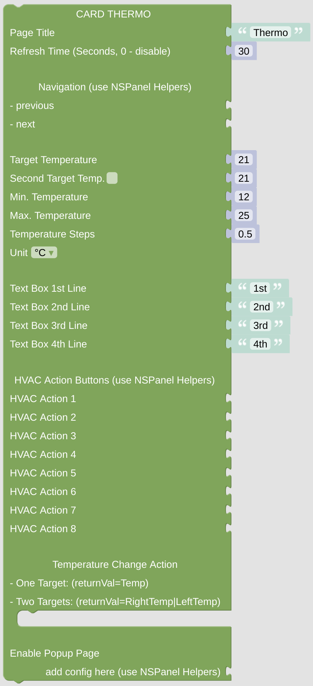

# cardThermo

The cardThermo is made to control one or two temperature settings for your home evironment.

[Example Configuration](openhab_scripts_nspanel1_cardThermo.md)

**Important:** This *Card* will do nothing if called directly without any context. At least it requires some information about the *NSPanel Item* to work with, which is usually supplied from the *CallBack* calling the script with this *Card*. To [enable direct testing in your Blockly editor](blockLibrary_nspanel_helpers_setNSPanelIfNotContext.md) or to [force the *NSPanel Item*](blockLibrary_nspanel_helpers_startScriptWithContext.md) you can use the related helpers. To get to know [which *NSPanel Item* you are working on](blockLibrary_nspanel_helpers_getContextItem.md), use some helper as well. 

## Configuration

### Standard Top Configuration

- The Page Title which is used for this page.
- The Refresh Time, after that time the page contents got refreshed. This might be useful when displaying some changing entities on the page, like lights or switches, to keep them in sync with their openHAB status (you can also use some rule to trigger the update via the [Callback remote control options](blockLibrary_nspanel_callback_callback.md)). This refresh timeout won't work (and will be ignored) when [directly started with context](blockLibrary_nspanel_helpers_startScriptWithContext.md), it needs to be called from *CallBack* for this to work.
- Navigation items (previous, next) to easily enable some link to other cards. Best choose the [Navigation String Helper](blockLibrary_nspanel_helpers_navString.md) from the NSPanel Helpers Menu. These items will be displayed in the top area left or right.

### Special Configuration for cardThermo

- Set the *Target Temperature* as the temperature displayed in the indicator.
- Decide, if you like to display and control a second temperature and set the displayed value.
- Configure minimum and maximum temperature, the temperature steps and the temperature unit for both main and second temperature.
- Configure the texts displayed on the left side.
- Add up to 8 [HVAC buttons](blockLibrary_nspanel_helpers_hvacButton.md) below the other controls. Only the Icon is shown, you can press theses buttons to start some action.
- Configure some action, which is triggered if the temperature is changed. If you control two temperatures, the returValue variable contains always both temperatures separated by '|'.
- You can add some popup page and configure it here using the [popupThermo](blockLibrary_nspanel_cards_popupThermo.md) module from the cards toolbox. 

---

[Openhab Blockly Nspanel - Library Documentation](README.md)

---
