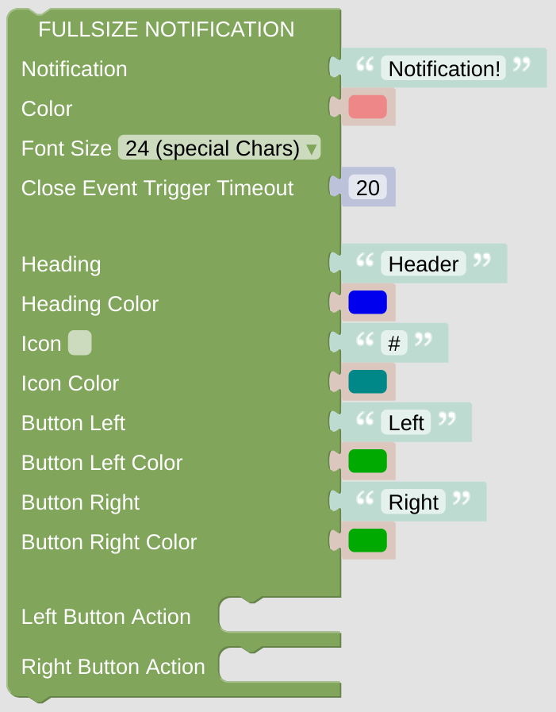

# Full Page Notification

This notification will be shown above your current page and can be closed manually or automatically. This Notification is similar to a Card and has some similar configurations.

**Important:** This *Card* will do nothing if called directly without any context. At least it requires some information about the *NSPanel Item* to work with, which is usually supplied from the *CallBack* calling the script with this *Card*. To [enable direct testing in your Blockly editor](blockLibrary_nspanel_helpers_setNSPanelIfNotContext.md) or to [force the *NSPanel Item*](blockLibrary_nspanel_helpers_startScriptWithContext.md) you can use the related helpers. To get to know [which *NSPanel Item* you are working on](blockLibrary_nspanel_helpers_getContextItem.md), use some helper as well.

## Configuration

- Add some notification text choose a color and a font size. Some fonts support Icons as well, just try it.
- Configure the timeout, after which the notification will be closed automatically.
- Configure some notification header and some icon, if you like.
- Add some button on the lower left and right area. Choose the actions triggered on left or right button press. 

---

[Openhab Blockly Nspanel - Library Documentation](README.md)

---
