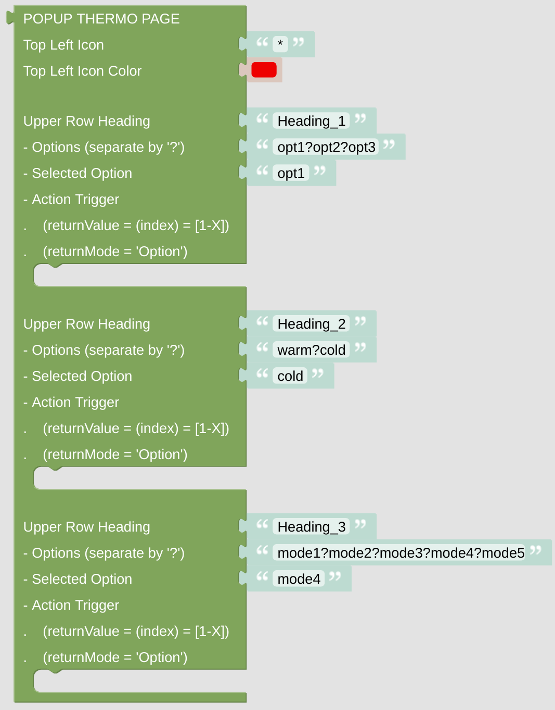

# popupThermo

The popupThermo gives you a page with up to three rows, where you can select different modes or presets of your evironment control system.

## Configuration

- Configure the top left Icon.

- Add up to 3 different selectors to the popup. Separate the possible options with a question mark '?'. Add some action to this selector, the [*returnValue* variable](blockLibrary_nspanel_helpers_returnValue.md) will give you the index of the choosen option (counting from 0).

 

---

[Openhab Blockly Nspanel - Library Documentation](README.md)

---
