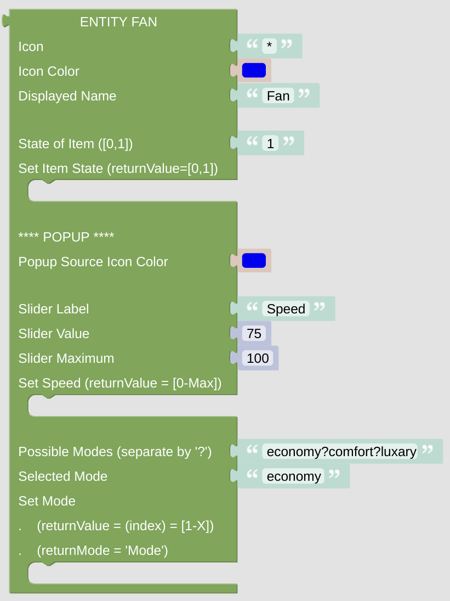

# Entity Fan

This entity gives you some option to switch your fan on and off and control the speed and the mode with some popup.

## Configuration

- Icon: just enter any character or (short) string, preferably some Icon string. It can be generated with the [getIconForName](blockLibrary_nspanel_helpers_getIconForName.md) helper or just copied manually from the [Material Design Icons](https://docs.nspanel.pky.eu/icon-cheatsheet.html) page.

- Icon Color: use some suitable color for the icon. Be aware, that the color selector will let you choose some 24bit color, while on the display you can only use 16bit colors. The conversion will be done internally.

- Displayed Name: it is usually shown close to the Icon.

- State of the Item: provide a value of '0' or '1' to render the switch on or off on the display.

- Switch Action: just add some statement, which is called when the switch is pressed. On cardEntitites you will can use the [*returnValue* variable](blockLibrary_nspanel_helpers_returnValue.md) in your statements, which will hold '0' or '1' dependent on the current switch state. Be aware that you might not find this variable in the main toolbox variables section, check the libraries helper section for that.

### Popup Configuration

- Configure the Icon color of the selector popup page.

- Set the Slider Label, configure the preset position of the slider and set the maximum slider position.

- If the slider is moved, the *Set Speed* action is triggered. The [*returnValue* variable](blockLibrary_nspanel_helpers_returnValue.md) will contain the value of the current slider position.

- Separate the possible modes with a question mark '?' and configure the pre-selected mode. Add some action to this selector, the returnValue variable will give you the index of the choosen option (counting from 0).

---

[Openhab Blockly Nspanel - Library Documentation](README.md)

---
