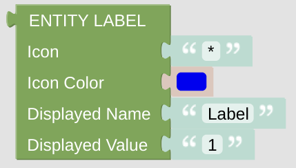

# Entity Label

This is some label, which can be used to display some information. It will be used for screensaver information, but might be useful on a lot of cards. 

## Configuration

- Icon: just enter any character or (short) string, preferably some Icon string. It can be generated with the [getIconForName](blockLibrary_nspanel_helpers_getIconForName.md) helper or just copied manually from the [Material Design Icons](https://docs.nspanel.pky.eu/icon-cheatsheet.html) page.
- Icon Color: use some suitable color for the icon. Be aware, that the color selector will let you choose some 24bit color, while on the display you can only use 16bit colors. The conversion will be done internally.
- Displayed Name: it is usually shown close to the Icon.
- Displayed Value: often this string is used to display some value, but there are situations where this string is just ignored. This will happen for instance on the standard screensaver page. The main weather icon is just too big for the required additional line. 

---

[Openhab Blockly Nspanel - Library Documentation](README.md)

---
