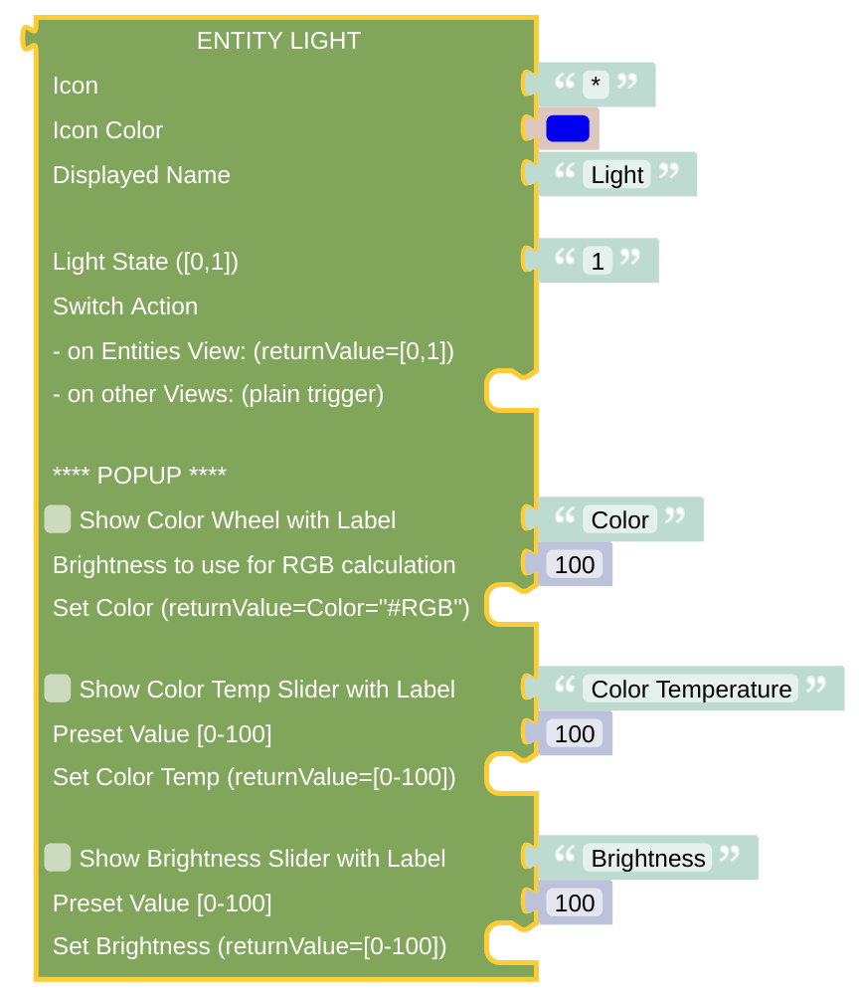

# Entity Light

This is some light switch, which is similar to some [standard switch](blockLibrary_nspanel_entities_switch.md) but allows you to access some popup page for smart lamp configurations.

## Configuration

- Icon: just enter any character or (short) string, preferably some Icon string. It can be generated with the [getIconForName](blockLibrary_nspanel_helpers_getIconForName.md) helper or just copied manually from the [Material Design Icons](https://docs.nspanel.pky.eu/icon-cheatsheet.html) page.
- Icon Color: use some suitable color for the icon. Be aware, that the color selector will let you choose some 24bit color, while on the display you can only use 16bit colors. The conversion will be done internally.
- Displayed Name: it is usually shown close to the Icon.
- Light State: provide a value of '0' or '1' to render the switch on or off on the display.
- Switch Action: just add some statement, which is called when the switch is pressed. On cardEntitites you will can use the [*returnValue* variable](blockLibrary_nspanel_helpers_returnValue.md) in your statements, which will hold '0' or '1' dependent on the current switch state. Be aware that you might not find this variable in the main toolbox variables section, check the libraries helper section for that.

### Popup Configuration

- Enable a Color Wheel if you like. Once you change the color, some action is triggered. To calculate the resulting *RGB Color* value, you need to supply some brightness. Take it from to-be-controlled *Item* itself (by using the same input as for the Brightness Slider preset) or just leave it at full brightness value (100). The [*returnValue* variable](blockLibrary_nspanel_helpers_returnValue.md) will contain the selected color, as a usual RGB-String like '#ffa3c2'. It can be directly used or converted to HSB with the related Color library tool.
- Enable a Color Temperature Slider. You can give the slider a preset value and will get the selected value in the [*returnValue* variable](blockLibrary_nspanel_helpers_returnValue.md) for the change action.
- Enable a Brightness Slider. You can give the slider a preset value and will get the selected value in the [*returnValue* variable](blockLibrary_nspanel_helpers_returnValue.md) for the change action. 

---

[Openhab Blockly Nspanel - Library Documentation](README.md)

---
