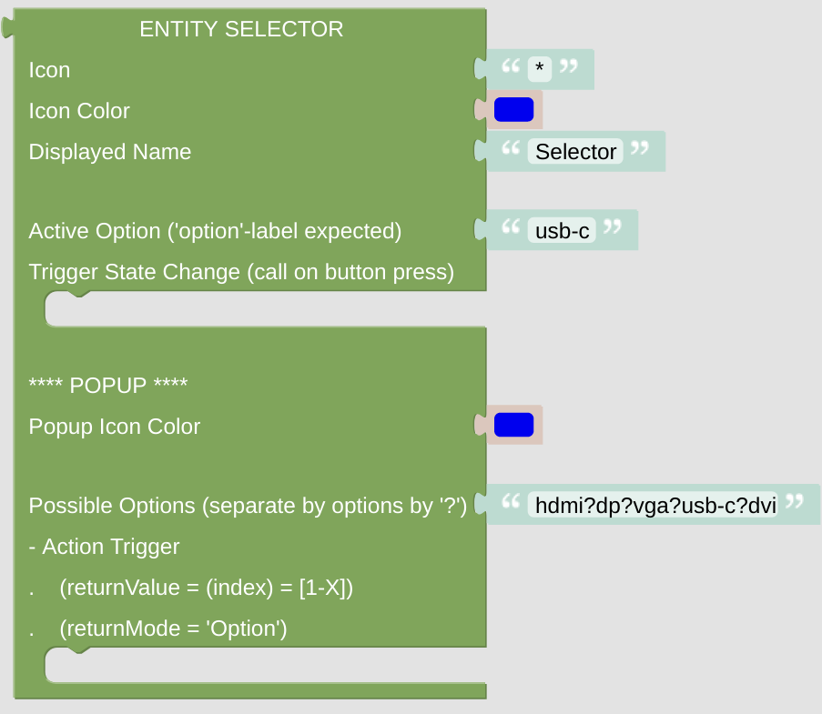

# Entity Selector

This entity gives you some selection option, for instance to select some input of your amplifier or some mode of your heating system.

## Configuration

- Icon: just enter any character or (short) string, preferably some Icon string. It can be generated with the [getIconForName](blockLibrary_nspanel_helpers_getIconForName.md) helper or just copied manually from the [Material Design Icons](https://docs.nspanel.pky.eu/icon-cheatsheet.html) page.

- Icon Color: use some suitable color for the icon. Be aware, that the color selector will let you choose some 24bit color, while on the display you can only use 16bit colors. The conversion will be done internally.

- Displayed Name: it is usually shown close to the Icon.

- Choose the active option, it is displayed on the [cardEntities](blockLibrary_nspanel_cards_cardEntities.md) and can trigger some action if pressed (for instance changing to the next mode).

### Popup Configuration

- Configure the Icon color of the selector popup page.

- Separate the possible options with a question mark '?'. Add some action to this selector, the [*returnValue* variable](blockLibrary_nspanel_helpers_returnValue.md) will give you the index of the choosen option (counting from 0).

---

[Openhab Blockly Nspanel - Library Documentation](README.md)

---
