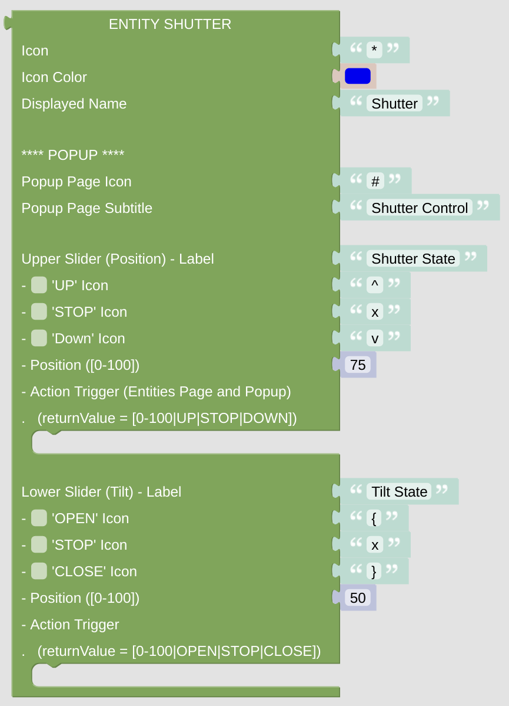

# Entity Shutter

This is some shutter control, on the entities view it will give you some up-down controls. On all views you will get access to some popup page, allowing you to control your shutters in detail.

## Configuration

- Icon: just enter any character or (short) string, preferably some Icon string. It can be generated with the [getIconForName](blockLibrary_nspanel_helpers_getIconForName.md) helper or just copied manually from the [Material Design Icons](https://docs.nspanel.pky.eu/icon-cheatsheet.html) page.
- Icon Color: use some suitable color for the icon. Be aware, that the color selector will let you choose some 24bit color, while on the display you can only use 16bit colors. The conversion will be done internally.
- Displayed Name: it is usually shown close to the Icon.
- If you are using this entity block on the [Card Entities](blockLibrary_nspanel_cards_cardEntities.md), you can change the shutter position from the main page as well as from the popup page. Use the popup *Action Trigger* to configure this action. 

### Popup Configuration

- Configure the Icon and the Label of the shutter popup page.
- You can configure two sliders. Usually the upper oe is used for the shutter position, the lower one is used for the shutter tilt. Select the control Icons and the preset position, the later by using a value between 0 and 100.
- The [*returnValue* variable](blockLibrary_nspanel_helpers_returnValue.md) of the triggered action is different for both sliders. The upper one will give you a number between 0 and 100 if the slider was moved or 'up', 'stop', 'down' dependend on the pressed button. The lower one will give you a number between 0 and 100 if the slider was moved or 'open', 'stop', 'close' dependend on the pressed button. 

---

[Openhab Blockly Nspanel - Library Documentation](README.md)

---
