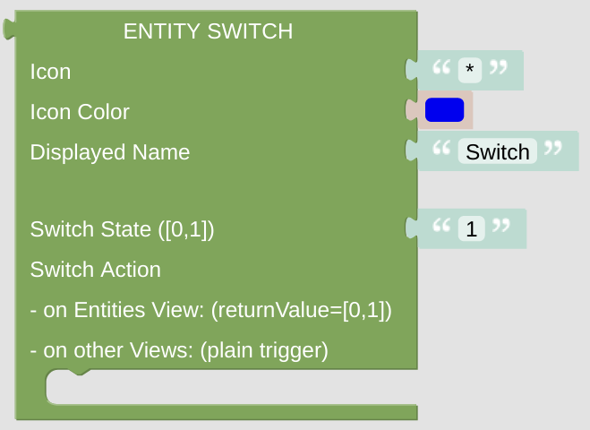

# Entity Switch

This is some switch, which can be used to display some information and might be rendered as a real switch (for instance on cardEntity). It can also trigger some action, dependent on the state of the switch.

## Configuration

- Icon: just enter any character or (short) string, preferably some Icon string. It can be generated with the [getIconForName](blockLibrary_nspanel_helpers_getIconForName.md) helper or just copied manually from the [Material Design Icons](https://docs.nspanel.pky.eu/icon-cheatsheet.html) page.

- Icon Color: use some suitable color for the icon. Be aware, that the color selector will let you choose some 24bit color, while on the display you can only use 16bit colors. The conversion will be done internally.

- Displayed Name: it is usually shown close to the Icon.

- Switch State: provide a value of '0' or '1' to render the switch on or off on the display. 

- Switch Action: just add some statement, which is called when the switch is pressed. On cardEntitites you will can use the [*returnValue* variable](blockLibrary_nspanel_helpers_returnValue.md) in your statements, which will hold '0' or '1' dependent on the current switch state. Be aware that you might not find this variable in the main toolbox variables section, check the libraries helper section for that.

---

[
Openhab Blockly Nspanel - Library Documentation
](README.md)

---
