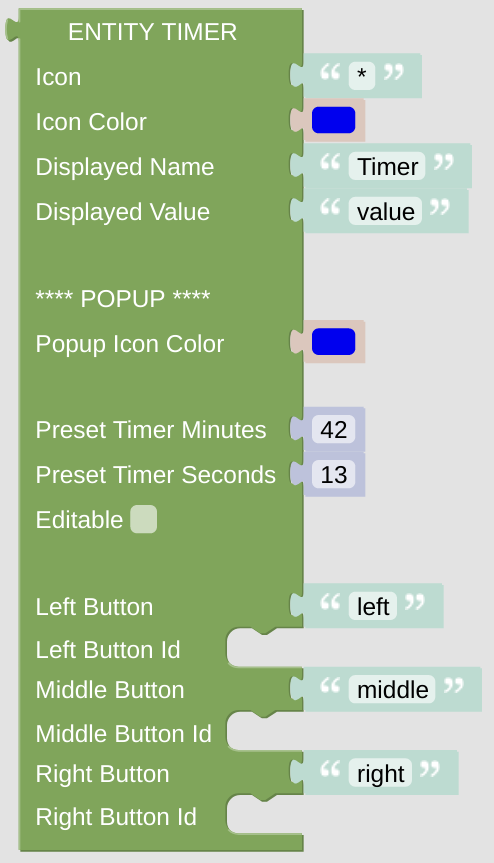

# Entity Timer

This entity gives you some option to configure a timer and trigger some actions dependent on the timer values.

## Configuration

- Icon: just enter any character or (short) string, preferably some Icon string. It can be generated with the [getIconForName](blockLibrary_nspanel_helpers_getIconForName.md) helper or just copied manually from the [Material Design Icons](https://docs.nspanel.pky.eu/icon-cheatsheet.html) page.

- Icon Color: use some suitable color for the icon. Be aware, that the color selector will let you choose some 24bit color, while on the display you can only use 16bit colors. The conversion will be done internally.

- Displayed Name: it is usually shown close to the Icon.

- Displayed Value: the value of the timer, might be hidden depending on the card it is used on.

### Popup Configuration

- Configure the Icon color of the selector popup page.

- Set the timer preset and choose, if the user can edit the timer.

- Add three buttons below the timer and choose some action, which is triggered on buttonpress.

---

[
Openhab Blockly Nspanel - Library Documentation
](README.md)

---
