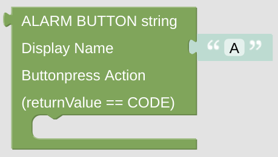

# Alarm Button

The Alarm Button is only used on the [Alarm Card](blockLibrary_nspanel_cards_cardAlarm.md) to allow different actions there.

## Configuration

- Configure the displayed name.
- Configure the triggered action, the [*returnValue* variable](blockLibrary_nspanel_helpers_returnValue.md) will contain the code which was entered.

 

---

[Openhab Blockly Nspanel - Library Documentation](README.md)

---
