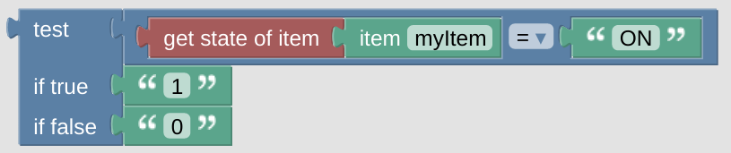

# Example Getter

This is just some example, for instance to set some [Switch](blockLibrary_nspanel_entities_switch.md) value based on the state of some *Item*. You can modify this getter the way you like, it is just for reference and might not fit your environment at all.

 

---

[
Openhab Blockly Nspanel - Library Documentation
](README.md)

---
