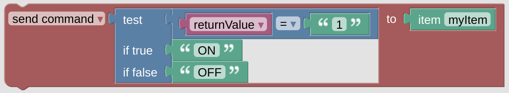

# Example Setter

This is an example for some action which is triggered for instance by modifying a [Switch](blockLibrary_nspanel_entities_switch.md) setting. You can see, that the [*returnValue* variable](blockLibrary_nspanel_helpers_returnValue.md) is used to access the result from you action on the display - in this case it will contain 1 or 0. This value is used to set the state of the Item - be aware that this is only an example and will surely not fit your environment.

 

---

[
Openhab Blockly Nspanel - Library Documentation
](README.md)

---
