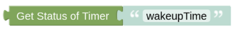

# getTimerStatus

## Configuration

You need to enter the unique Name of your Timer as you have set it in the [Timer Entity](blockLibrary_nspanel_entities_timer.md). As a result of this helper you will get the status of the Timer, ON or OFF (running or stopped). 

---

[Openhab Blockly Nspanel - Library Documentation](README.md)

---
