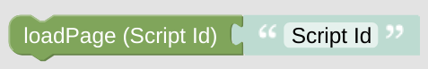

# loadPage

**Important:** This *helper* will do nothing if called directly without any context. It requires some information about the *NSPanel Item* to work with. If you don't use this helper in any script called by your CallBack (like some Card), you need to [set the context yourself](blockLibrary_nspanel_helpers_startScriptWithContext.md).

## Configuration

Add the Script you like to load (Use the Script Id, not the label). This script will be loaded to your panel trough some [indirect call trough your CallBack](blockLibrary_nspanel_callback_callback.md#loadpage), therefore your CallBack has to be configured and working. Be aware but it's completely on your side to care that this really loads a script containing a Card/Page. You might destroy the page you will enter every time you are leaving the Screensaver when doing this wrong. 

---

[Openhab Blockly Nspanel - Library Documentation](README.md)

---

