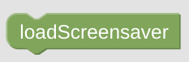

# loadScreensaver

**Important:** This *helper* will do nothing if called directly without any context. It requires some information about the *NSPanel Item* to work with. If you don't use this helper in any script called by your CallBack (like some Card), you need to [set the context yourself](blockLibrary_nspanel_helpers_startScriptWithContext.md).

## Configuration

There is no configuration required. The Screensaver will just get activated immediately on your panel trough some [indirect call trough your CallBack](blockLibrary_nspanel_callback_callback.md#loadscreensaver). Your CallBack has to be configured and working. 

---

[Openhab Blockly Nspanel - Library Documentation](README.md)

---

