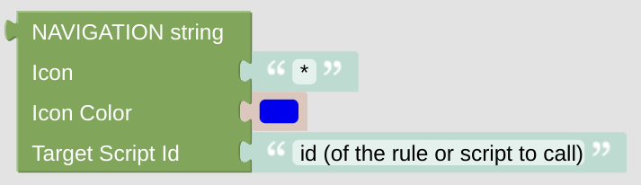

# Navigation String

The navigation string is used to connect your display *Cards* (Pages) between each other. Every Card has some navigational Icons on the top left and right. Connecting with this Icons to some other pages you can scroll around all your pages the way you like.

## Configuration

- Add some Icon and set the color you like.
- Add some *Card* (Page) to navigate to. You should enter some target script Id. This script gets called when you press the navigational button and usually renders some new *Card*. 

---

[Openhab Blockly Nspanel - Library Documentation](README.md)

---
