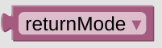

# returnMode

The *returnMode* environment variable can be used in your action statements to get the selected option or mode. This variable will contain the selected *Option String* and can only be used on the following Entities or Popups:

- [popupThermo](blockLibrary_nspanel_cards_popupThermo)
- [entity Selector](blockLibrary_nspanel_entities_selector)
- [entity Fan](blockLibrary_nspanel_entities_fan)

You might not find this variable in your standard variable toolbox, just use the one from your helpers list instead. 

---

[Openhab Blockly Nspanel - Library Documentation](README.md)

---
