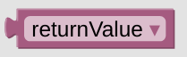

# returnValue

The *returnValue* environment variable can be used in your action statements to get the values entered or configured trough your display. This variable might contain numbers or strings, this really depends on the usage ad is usually noted in your Card description.

You might not find this variable in your standard variable toolbox, just use the one from your helpers list instead.

 

---

[
Openhab Blockly Nspanel - Library Documentation
](README.md)

---
