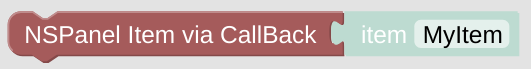

# set NSPanel Item if Context not found

The *Cards* you are going to create, the Pages you are going to display on the panel are configured in scripts without any information about the *NSPanel Items* they should run on. This information is provided by the calling *CallBack* rule, which is triggered by the panel you are working with. This way you can re-use the same *Card* for different Panels in your automation.

The drawback of this concept is, that you can't easily test some card directly in your Blockly editor.

This module gives you the chance to do a 'real-testing' just within your editor. It checks, if the context information is missing. If so, it will trigger a [loadPage](blockLibrary_nspanel_callback_callback.md#loadpage) update with the own script id and reload the page trough your *CallBack*. This also means, that it will only work if your *[CallBack* is configured](blockLibrary_nspanel_callback_callback.md#loadpage) the way it should. To test your *Card* without a working *CallBack*, you can also [force the *NSPanel Item* to work with](blockLibrary_nspanel_helpers_startScriptWithContext.md).

You can leave this helper module also in the script while using this script in your multi panel setup - it will always check if the context is already set and never will get in your way. Check the [Card Grid Example](openhab_scripts_nspanel1_cardGrid.md) for the usual application.

Be aware that the *Card* might be refreshed automatically with it's refresh timer if you configured it to do so.

## Configuration

- The *NSPanel Item* which is used to control the panel with MQTT.
- You should your *Cards* as a *Statement* below the module. 

---

[Openhab Blockly Nspanel - Library Documentation](README.md)

---
