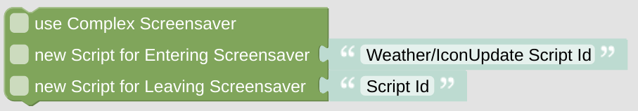

# set Screensaver Scripts

**Important:** This *helper* will do nothing if called directly without any context. It requires some information about the *NSPanel Item* to work with. If you don't use this helper in any script called by your CallBack (like some Card), you need to [set the context yourself](blockLibrary_nspanel_helpers_startScriptWithContext.md).

## Configuration

Using this helper you always have to device if you like to use the normal or the complex Screensaver and check the box.

Additionally you can re-configure the scripts, which are called for entering or leaving the ScreenSaver. If you set any script for leaving the ScreenSaver, this script becomes some 'landing page'. If you supply some empty string for this script, the option of the landing script gets removed and you will always end on the last called page when leaving the Screensaver.

All this is done via indirect calls trough your CallBack ([complexScreenSaver](blockLibrary_nspanel_callback_callback.md#complexscreensaver), [enterScriptName](blockLibrary_nspanel_callback_callback.md#enterscriptname), [leaveScriptName](blockLibrary_nspanel_callback_callback.md#leavescriptname)). Your CallBack has to be configured and working. 

---

[Openhab Blockly Nspanel - Library Documentation](README.md)

---
