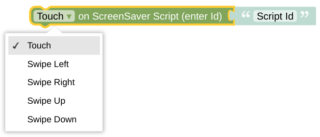

# set Screensaver Scripts - Complex Configuration

**Important:** This *helper* will do nothing if called directly without any context. It requires some information about the *NSPanel Item* to work with. If you don't use this helper in any script called by your CallBack (like some Card), you need to [set the context yourself](blockLibrary_nspanel_helpers_startScriptWithContext.md).

## Configuration

Choose the script you wan't to replace in your callback configuration. Be aware that this script might only be used if there is no other last known page to display - if you like to force the usage of this script on the related action you need to use the [Complex LandingPage configuration](blockLibrary_nspanel_helpers_setScreenSaverScriptsComplex_LandingPage.md) instead.

All this is done via indirect calls trough your [CallBack API](blockLibrary_nspanel_callback_API.md) - your CallBack has to be configured and working. 

---

[Openhab Blockly Nspanel - Library Documentation](README.md)

---
