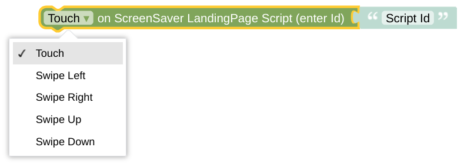

# set Screensaver Scripts - Complex Configuration for Landingpage

**Important:** This *helper* will do nothing if called directly without any context. It requires some information about the *NSPanel Item* to work with. If you don't use this helper in any script called by your CallBack (like some Card), you need to [set the context yourself](blockLibrary_nspanel_helpers_startScriptWithContext.md).

## Configuration

Choose the script you wan't to replace in your callback configuration. Be aware that this script is used as a Landing Page script. After you triggered the respective action, the script will be started and any previously displayed page will be forgotten.

All this is done via indirect calls trough your [CallBack API](blockLibrary_nspanel_callback_API.md) - your CallBack has to be configured and working. 

---

[Openhab Blockly Nspanel - Library Documentation](README.md)

---
