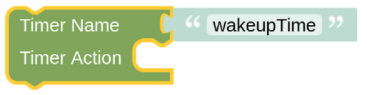

# setTimerAction

## Configuration

You need to enter the unique Name of your Timer as you have set it in the [Timer Entity](blockLibrary_nspanel_entities_timer.md). When the Countdown-Timer reaches zero or the Wakeup Time is reached, the added Action will be triggered.

The Wakeup/Countdown is stopped (if not daily Wakeup) and the CountDown Value is resetted. On daily Wakeups the Action is only triggered once, even if you call this helper more than once in the right minute.

Be aware that you need to check the timer every minute (if you used some Wakeup or Some Countdown of Hours:Minutes) or every second (if you used some Countdown of Minutes:Seconds), else your action might not be triggered. 

---

[Openhab Blockly Nspanel - Library Documentation](README.md)

---
