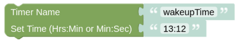

# setTimerNewTime

## Configuration

You need to enter the unique Name of your Timer as you have set it in the [Timer Entity](blockLibrary_nspanel_entities_timer.md). You can set the timer to a new target time or change the countdown time, the running state of the timer is not effected. 

---

[Openhab Blockly Nspanel - Library Documentation](README.md)

---
