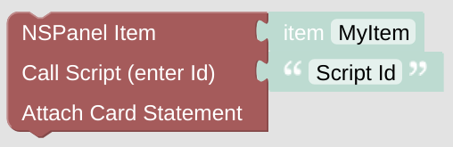
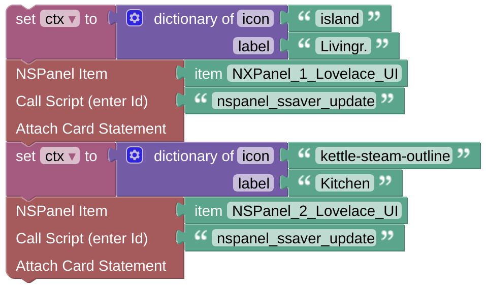
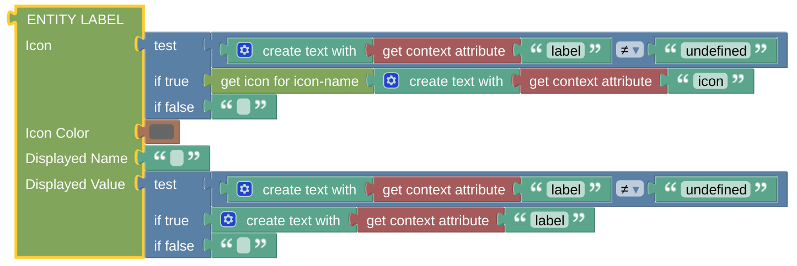

# start Script with forced Context

The *Cards* you are going to create, the Pages you are going to display on the panel are configured in scripts without any information about the *NSPanel Items* they should run on. This information is provided by the calling *CallBack* rule, which is triggered by the panel you are working with. This way you can re-use the same *Card* for different Panels in your automation.

The drawback of this concept is, that you can't easily test some card directly in your Blockly editor.

This module gives you the option to force this context information for any script you are going to call (for any Card you created). It might be really useful for instance to [update your screensaver](openhab_rules_ssaverupdate.md) information.

## Configuration

- The *NSPanel Item* which is used to control the panel with MQTT.
- add the ID of some script configuring your *Card* and / or
- add the statement configuring your card juft below.

As you can see, you can add additional *Cards* as *Statements*, they will all use the context *NSPanel Item* you just provided. 

## additional Context

If you like to use some centralized script with special features per display, you can also add some keys to the context dictionary *ctx*. Just add *ctx* as a variable and set the required items. 

In the targeted script you can access these items as contextual information, just use the supplied statements from openHAB to access the values.

---

[Openhab Blockly Nspanel - Library Documentation](README.md)

---
