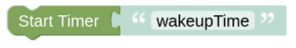

# startTimer

## Configuration

You need to enter the unique Name of your Timer as you have set it in the [Timer Entity](blockLibrary_nspanel_entities_timer.md). The Timer (Wakeup/Countdown) is started on call.

Be aware that you need to check the timer every minute (if you used some Wakeup or Some Countdown of Hours:Minutes) or every second (if you used some Countdown of Minutes:Seconds), else your action might not be triggered. 

---

[Openhab Blockly Nspanel - Library Documentation](README.md)

---
