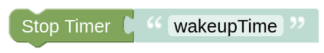

# stopTimer

## Configuration

You need to enter the unique Name of your Timer as you have set it in the [Timer Entity](blockLibrary_nspanel_entities_timer.md). The Timer (Wakeup/Countdown) is stopped on call. 

---

[Openhab Blockly Nspanel - Library Documentation](README.md)

---
