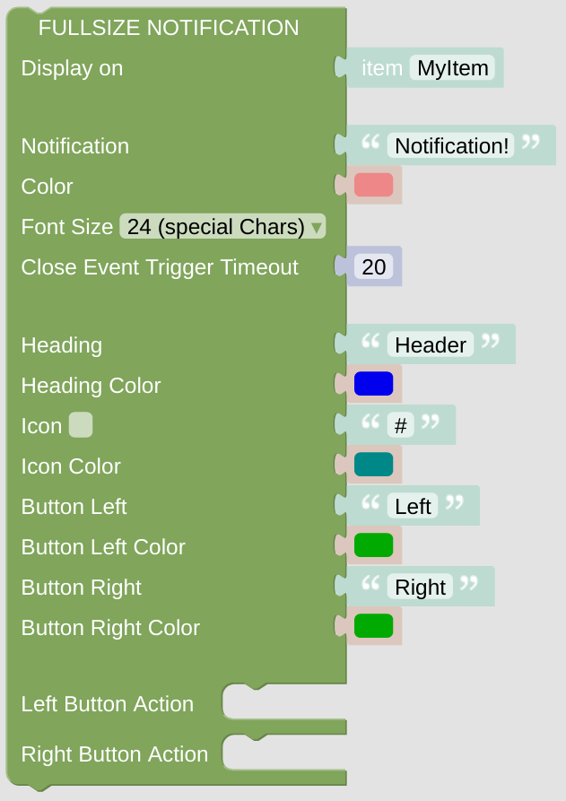

# Full Page Notification

This notification will be shown above your current page and can be closed manually or automatically. This Notification is similar to a Card and has some similar configurations.

## Configuration

- Configure the *NSPanel Item* which is used to control the panel with MQTT.

- Add some notification text choose a color and a font size. Some fonts support Icons as well, just try it.

- Configure the timeout, after which the notification will be closed automatically.

- Configure some notification header and some icon, if you like.

- Add some button on the lower left and right area. Choose the actions triggered on left or right button press.

 

---

[
Openhab Blockly Nspanel - Library Documentation
](README.md)

---
