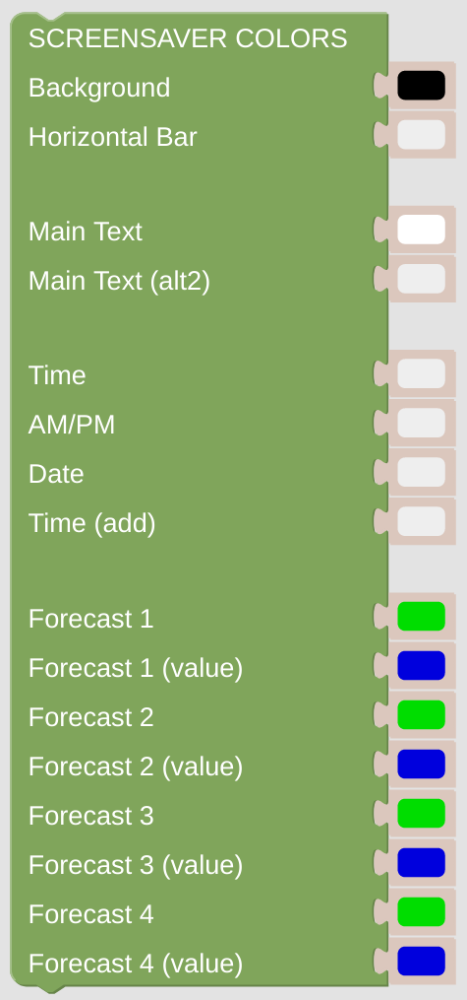

# Screen Saver Colors

You can configure the colors of your screensaver here.

## Configuration

- Configure the *NSPanel Item* which is used to control the panel with MQTT.

- Configure all the different colors.

 

---

[
Openhab Blockly Nspanel - Library Documentation
](README.md)

---
