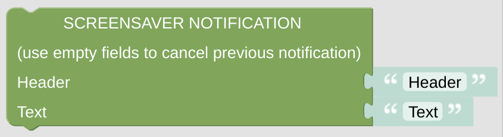

# Screensaver Notification

This notification will be shown inside your screensaver, hiding some of the screensaver icons. To hide the notification, just send some empty notification to the *NSPanel Item*.

## Configuration

- Configure the *NSPanel Item* which is used to control the panel with MQTT.

- Configure a Header and some descriptional Text.

 

---

[
Openhab Blockly Nspanel - Library Documentation
](README.md)

---
