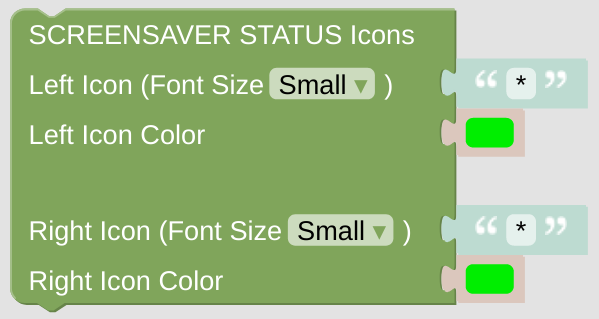

# Screensaver Status Icons

On the screensaver, two status Icons can be displayed on the top ([standard screensaver](https://docs.nspanel.pky.eu/img/screensaver.png)) or on the bottom ([complex screensaver](https://docs.nspanel.pky.eu/img/screensaver2.png)) of the display.

## Configuration

- Configure the *NSPanel Item* which is used to control the panel with MQTT.

- Configure the Icons and the Colors to be shown.

 

---

[Openhab Blockly Nspanel - Library Documentation](README.md)

---
