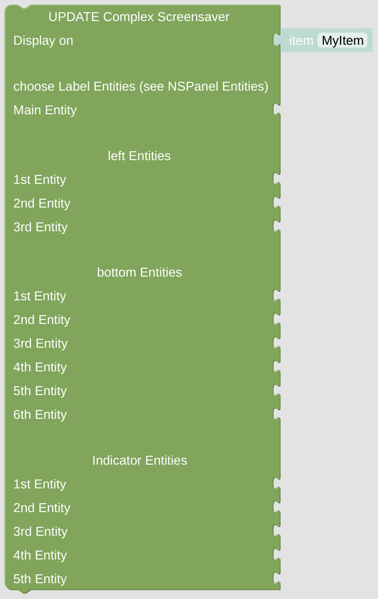

# Update Complex Screensaver

With this module you can set all the Icons and Texts for the [complex screensaver](https://docs.nspanel.pky.eu/img/screensaver2.png).

**Important:** This module will do nothing if called directly without any context. At least it requires some information about the *NSPanel Item* to work with, which is usually supplied from the *CallBack* calling the script with this module. To [enable direct testing in your Blockly editor](blockLibrary_nspanel_helpers_setNSPanelIfNotContext.md) or to [force the *NSPanel Item*](blockLibrary_nspanel_helpers_startScriptWithContext.md) you can use the related helpers. To get to know [which *NSPanel Item* you are working on](blockLibrary_nspanel_helpers_getContextItem.md), use some helper as well.

## Configuration

- Configure all entities by using [Label Entities](blockLibrary_nspanel_entities_label.md) from the helpers toolbox. Dependent on the position of the Entity, names and values might not be displayed. 

---

[Openhab Blockly Nspanel - Library Documentation](README.md)

---
