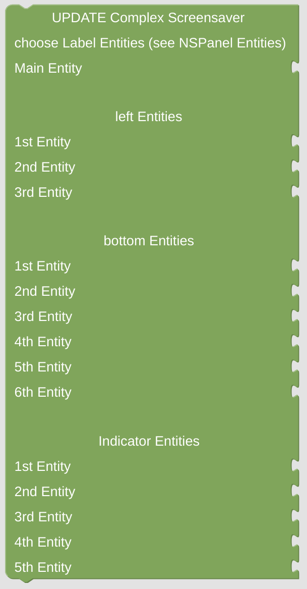

# Update Complex Screensaver

With this module you can set all the Icons and Texts for the [complex screensaver](https://docs.nspanel.pky.eu/img/screensaver2.png).

## Configuration

- Configure all entities by using [Label Entities](blockLibrary_nspanel_entities_label.md) from the helpers toolbox. Dependent on the position of the Entity, names and values might not be displayed.

 

---

[Openhab Blockly Nspanel - Library Documentation](README.md)

---
