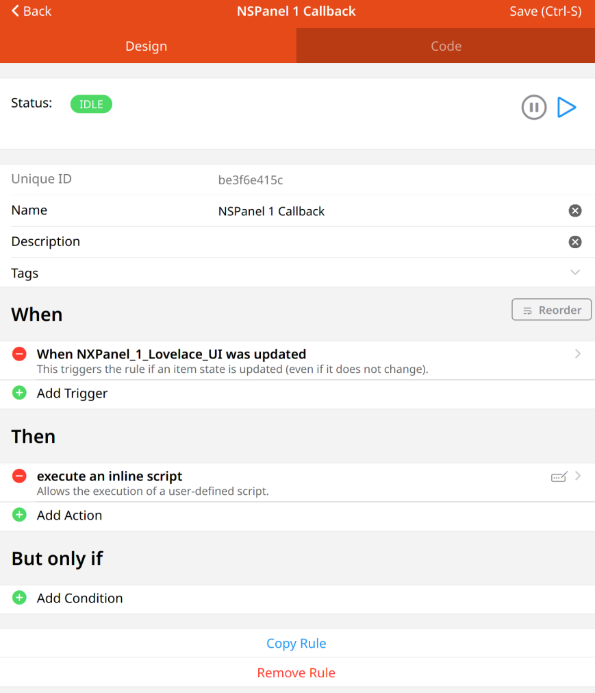
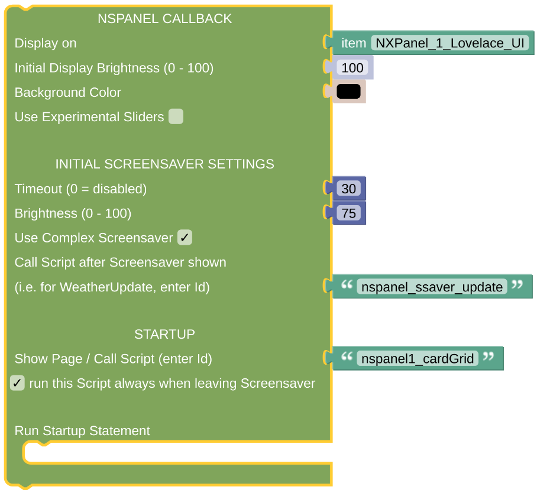

# Example Callback Rule

This is some working example of the Callback implementation.

## Configuration

- Add a rule which is triggered every time the *NSPanel Item* is updated. It should trigger on anny update, not only on any change, to allow repeated actions on updates with the same value.

 

- The callback can be configured as above. You might like to have a look at the [Callback Description](blockLibrary_nspanel_callback_callback.md) as well.

 

---

[
Openhab Blockly Nspanel - Library Documentation
](README.md)

---
