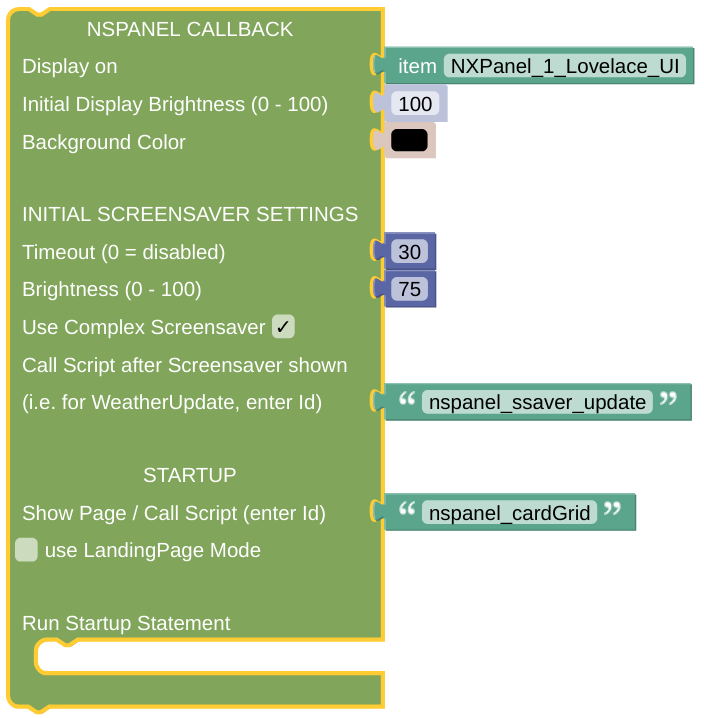

# Example Callback Rule

This is some working example of the Callback implementation. As the center of the whole NSPanel communication, it will contain the information of the related NSPanel Item. Therefore you will need one CallBack configured per any NSPanel Hardware you like to control.

## Configuration

- Add a rule which is triggered every time the *NSPanel Item* is updated. It should trigger on any update, not only on any change, to allow repeated actions on updates with the same value. 

- The callback can be configured as shown here. You might like to have a look at the [Callback Description](blockLibrary_nspanel_callback_callback.md) as well. 

- If you like, you can trigger the CallBack on hardware button presses as well. The currently displayed *Card* will be updated in this case, and might change some parts dependent on your code. 

---

[Openhab Blockly Nspanel - Library Documentation](README.md)

---
