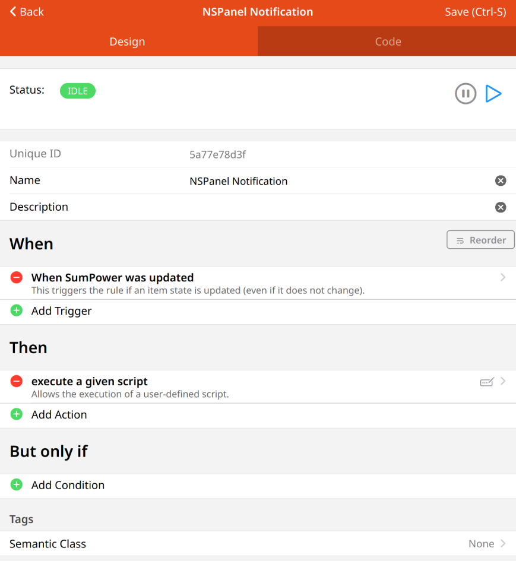
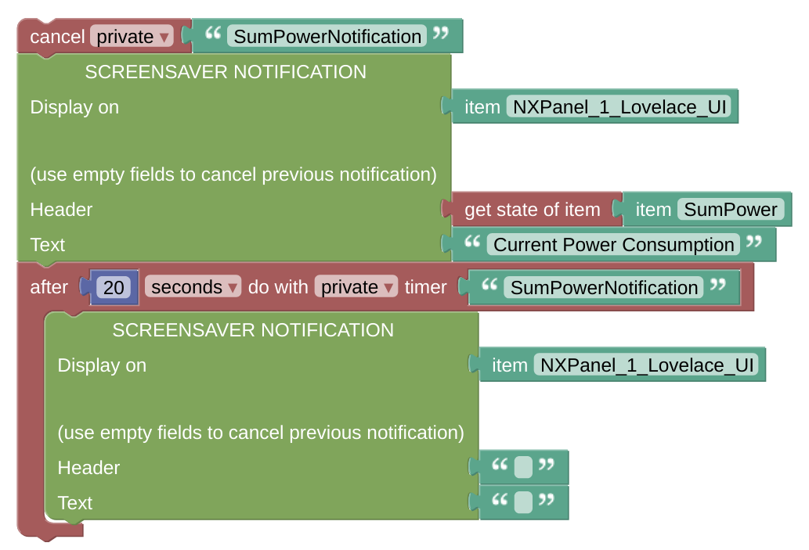

# Example Notification Rule

This is some working example of the Screensaver Notification.

## Configuration

- Add a rule which is triggered every time you like to show the notification. In my example case, it is shown every time the sum of the current power, registered in some other item, is updated.

 

- The notification can be configured as above. You might like to have a look at the [Notification Description](blockLibrary_nspanel_screensaver_screensaverNotification.md) as well.
- Some timer is added to remove the notification after a while by sending an empty notification.

 

---

[
Openhab Blockly Nspanel - Library Documentation
](README.md)

---
