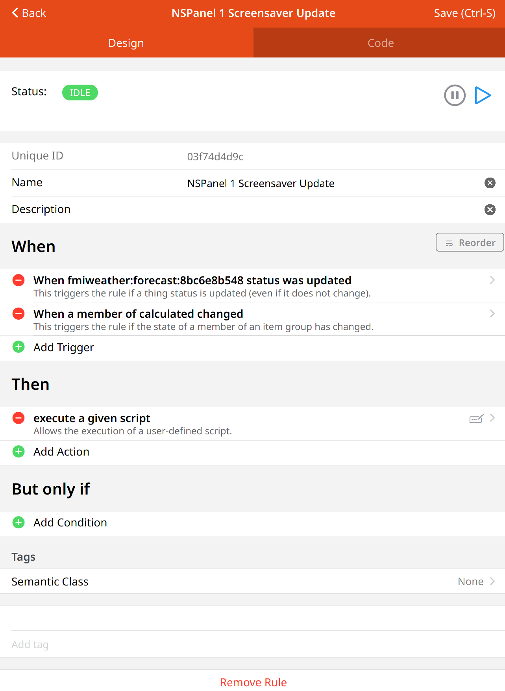
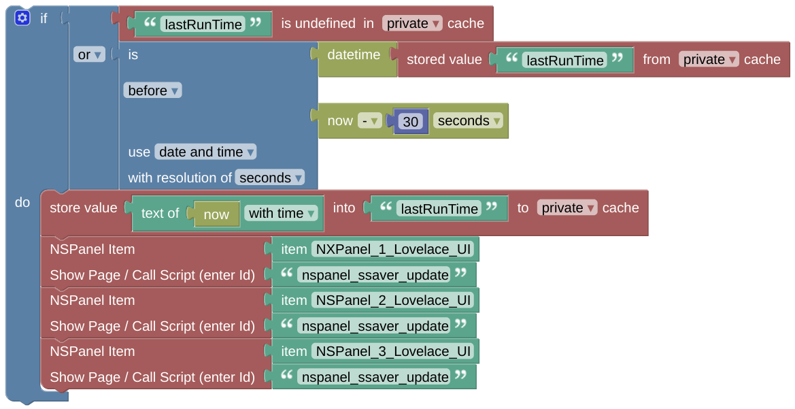
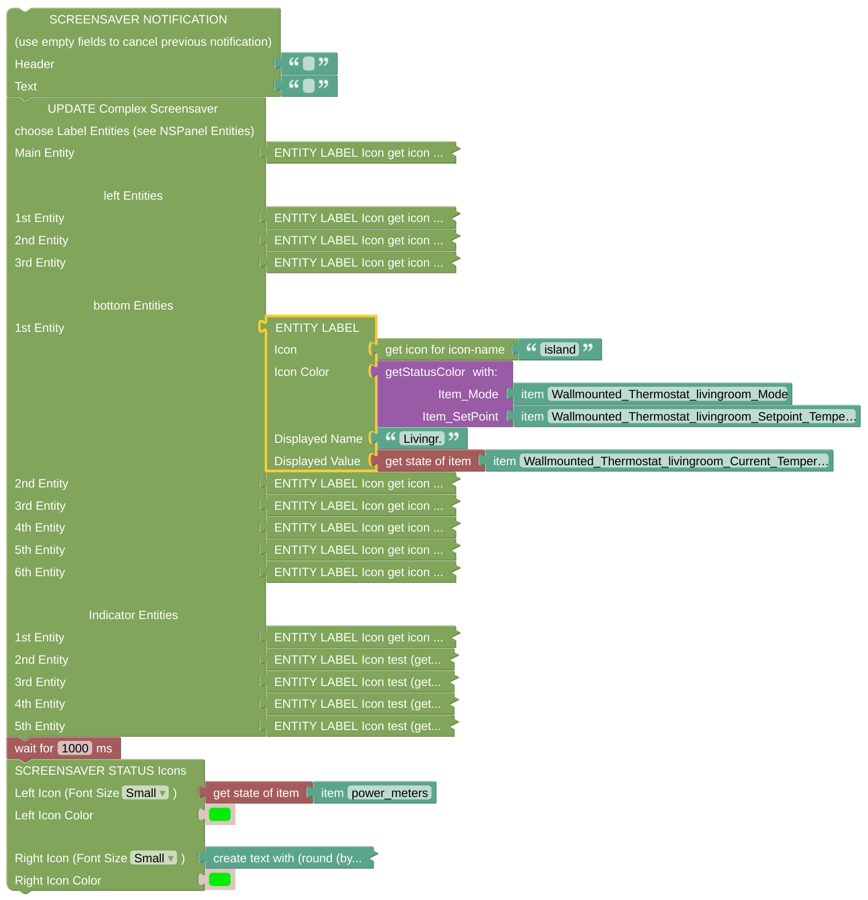

# Example Screensaver Update Rule

This is some working example of the Weather / Icon Update for the [standard screensaver](https://docs.nspanel.pky.eu/img/screensaver.png).

## Configuration

- Add a rule which is triggered every time you like to update the icons. In my example case, it is triggered every time the weather information received from FMI is updated. 

- In the core of the update script I am using you can see three calls of the update-script, one for all the hardware panels I am using. These scripts are just setting the Icons the way you like, have a look at the [Screensaver Update Description](blockLibrary_nspanel_screensaver_updateStandard.md) as well.
- The frame in this example is only used to prevent too many calls of the update scripts, in my case they are limited to one per half minute. 

- Beside you can see the script, which is called as 'nspanel_ssaver_update' on every trigger of this rule for every panel I own.
- The Icon (Label Entity) updates are only taken over, if there is no notifiction shown. Therefore the notification is removed before the Icons are updated.
- After the update of the screensaver items I like to display some values below as [Screensaver Statusicons](blockLibrary_nspanel_screensaver_screensaverStatusIcons.md). The delay is required, the panel does not like to get too much information without any pause and might ignore just some in-between-updates if they come in too fast.

---

[Openhab Blockly Nspanel - Library Documentation](README.md)

---
