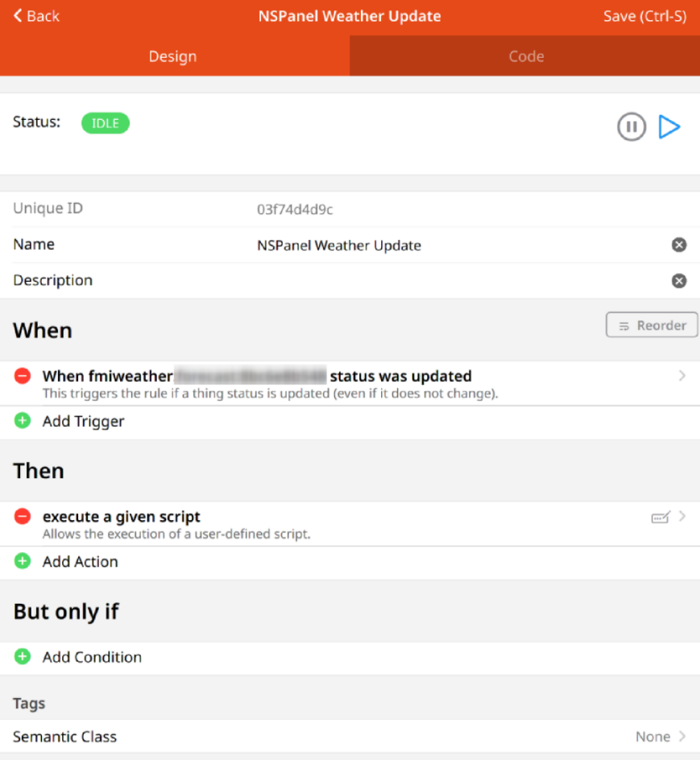
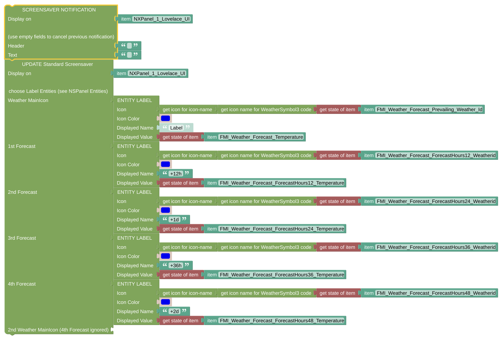

# Example Weather Update Rule

This is some working example of the Weather / Icon Update for the [standard screensaver](https://docs.nspanel.pky.eu/img/screensaver.png).

## Configuration

- Add a rule which is triggered every time you like to update the icons. In my example case, it is triggered every time the weather information received from FMI is updated. 

- The weather Icon can be configured as in the screenshot beside. You can also see that the notification is cleared before the icon is updated, it felt like sometimes updates are not taken if a [Notification](blockLibrary_nspanel_screensaver_screensaverNotification.md) was shown. You might like to have a look at the [Screensaver Update Description](blockLibrary_nspanel_screensaver_updateStandard.md) as well. 

---

[Openhab Blockly Nspanel - Library Documentation](README.md)

---
